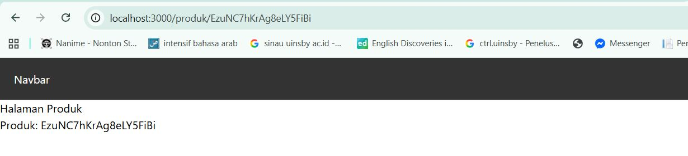
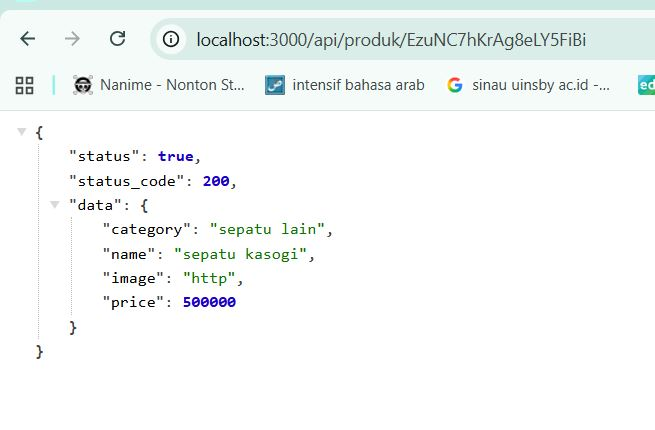
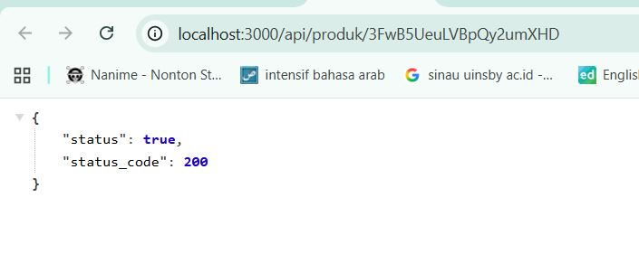
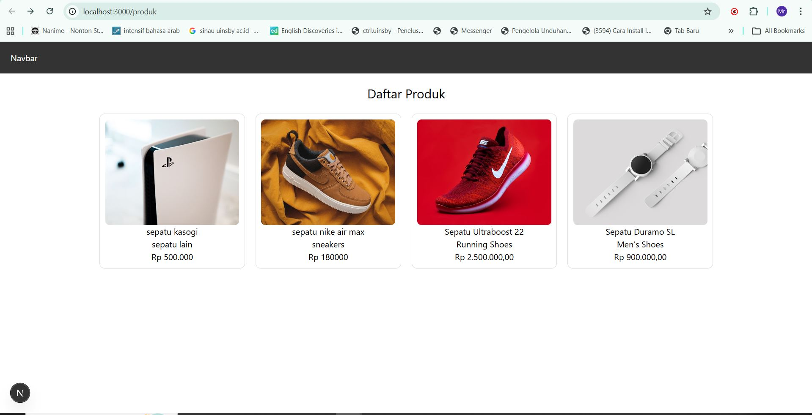
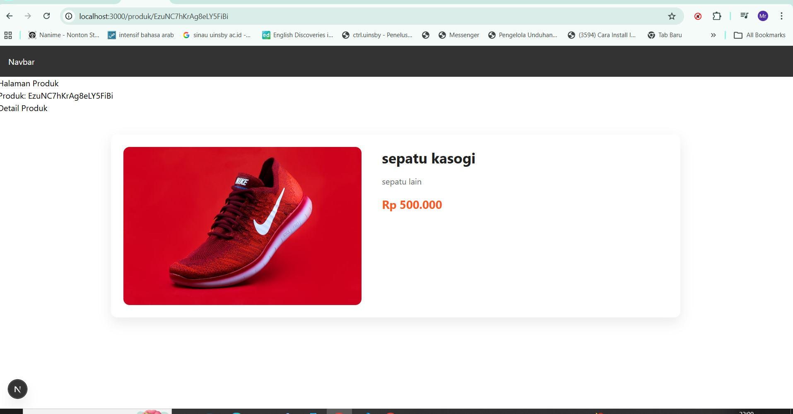
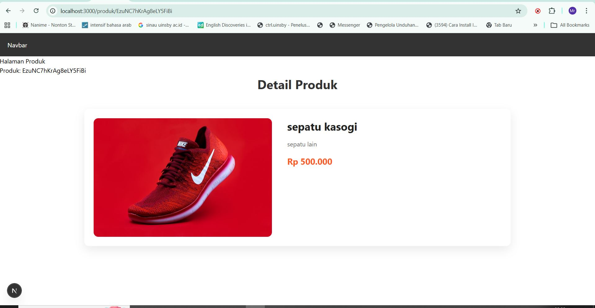
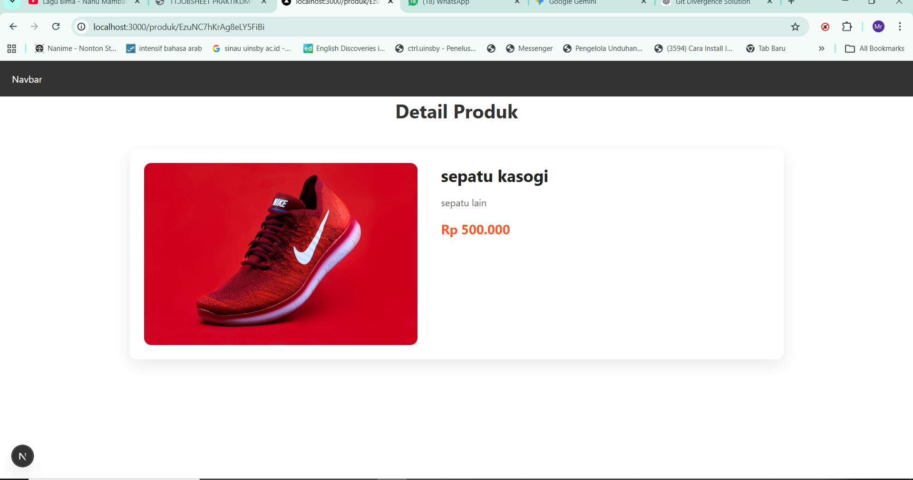
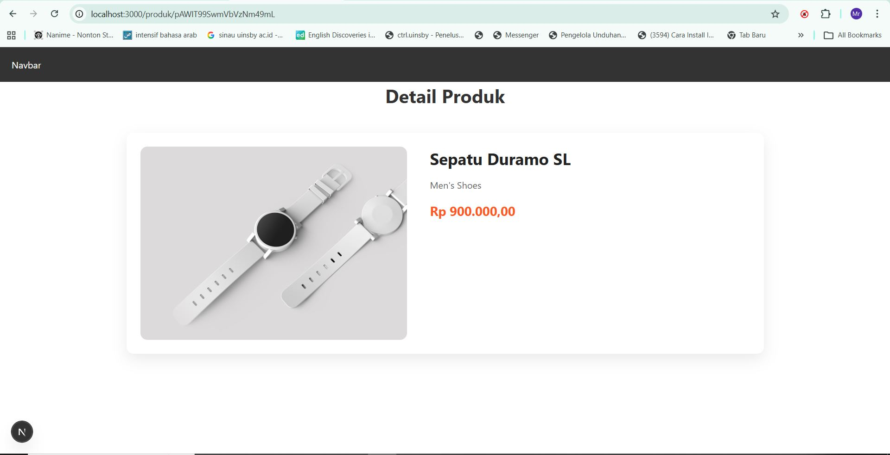
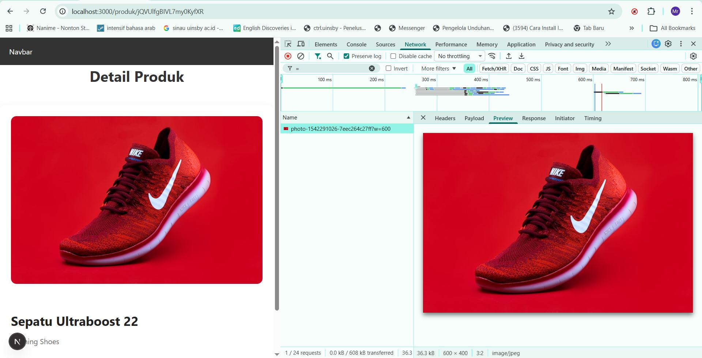
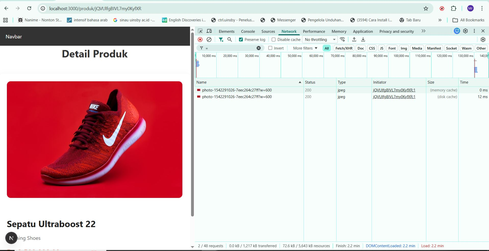

# 📘 Lembar Kerja 11  
**Mata Kuliah:** Kerangka Pemrograman Berbasis Framework  
**Nama:** Fajru Santoso  

---

## 🧪 Hasil Praktikum

### 🔹  Bagian 1 – Membuat Dynamic Route

Pada langkah ini dibuat *catch-all route* untuk menangani berbagai URL dinamis dalam aplikasi Next.js.

#### 📸 Hasil Implementasi:

---

---

## 🧪 Hasil Praktikum

### 🔹   Bagian 2 – Implementasi CSR (Client Rendering) 

Pada langkah ini dibuat *catch-all route* untuk menangani berbagai URL dinamis dalam aplikasi Next.js.

#### 📸 Hasil Implementasi:

---

---

## 🧪 Hasil Praktikum

### 🔹   Bagian 2 – Implementasi CSR (Client Rendering) 

 Buat file dengan nama index.tsx pada folder views/DetailProduct selain itu buat juga
file dengan nama detailProduct.module.scss

### ✏️ Modifikasi

| No | File | Modifikasi |
|:---|:---|:---|
| 1 | `detailProduct.module.scss` | Modifikasi styling |
| 2 | `index.tsx` | Modifikasi komponen DetailProduct |
| 3 | `[product].tsx` | Modifikasi file dynamic route |
| 4 | `index.tsx` (line 16) | Modifikasi baris ke-16 |

#### 📸 Hasil Implementasi:

---

---

## 🧪 Hasil Praktikum

### 🔹   Bagian 3 – Implementasi SSR 

Modifikasi [produk].tsx pada folder src/pages/produk dan comment line 9 sampai 20
dikarena kita akan menggunakan metode SSR. Tambahkan beberapa kode untuk SSR 

### ✏️ Modifikasi

| No | File | Modifikasi |
|:---|:---|:---|
| 1 | `Jalankan browser http://localhost:3000/produk/server |
| 2 | ` Tidak perlu loading state karena data sudah tersedia sebelum render.|

#### 📸 Hasil Implementasi:

---

---

## 🧪 Hasil Praktikum

###  Bagian 4 – Implementasi Static Site Generation (Dynamic SSG) 

o Buka file [produk].tsx dan modifikasi seperti berikut 

### ✏️ Modifikasi

| No | File | Modifikasi |
|:---|:---|:---|
| 1 | `o Buka file [produk].tsx dan modifikasi seperti berikut  |
| 2 | ` o Buka file index.tsx pada folder src/views/DetailProduct dan modifikasi pada line 11.|
| 3 | `Jalankan browser http://localhost:3000/produk  |
| 4 | ` Saat diklik salah satu produk |

#### 📸 Hasil Implementasi:

---

## 🧪 Hasil Praktikum

###   D. Pengujian  
Uji 1 – CSR

|    | File |  |
|:---|:---|:---|
| 1 | `o • Refresh halaman detail  |
| 2 | `• Perhatikan loading |
| 3 | `• Periksa Network → XHR → API request terlihat  |

#### 📸 Hasil Implementasi:

---

---

## 🧪 Hasil Praktikum

###   D. Pengujian  
 Uji 2 – SSR

|    | File |  |
|:---|:---|:---|
| 1 | `o • Refresh halaman detail  |
| 2 | `• • Tidak ada loading  |
| 3 | `• Periksa Network → tidak terlihat fetch detail  |

#### 📸 Hasil Implementasi:

---

---

## 🧪 Hasil Praktikum

###   D. Pengujian  
  Uji 3 – SSG ( Lakukan seperti langkah sebelumya pada Jobsheet 10)

|    | File |  |
|:---|:---|:---|
| 1 | `o Jalankan:
o npm run build
o npm run start  |
| 2 |  Tambahkan produk baru di database.  |
| 3 |  Buka halaman detail produk baru:  |
| 3 | Build ulang:
o npm run build
o npm run start
 Baru muncul.   |

#### 📸 Hasil Implementasi:

---

