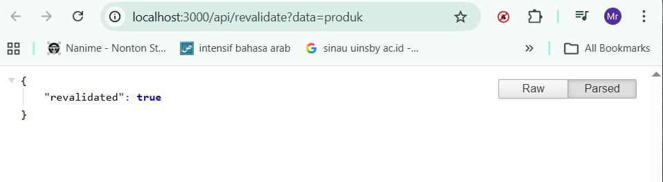
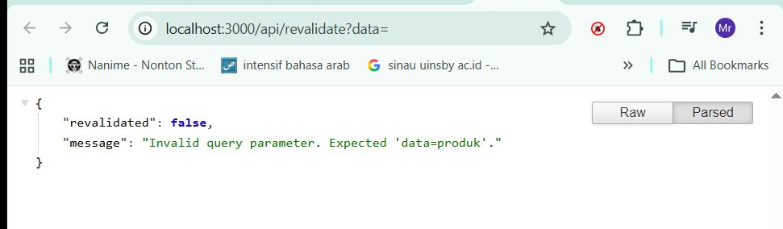
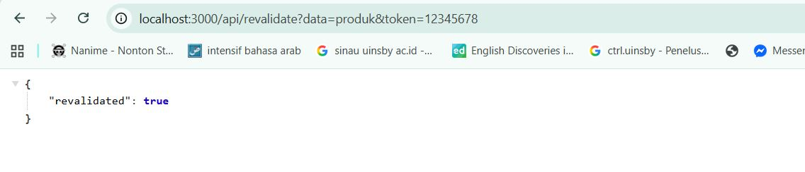
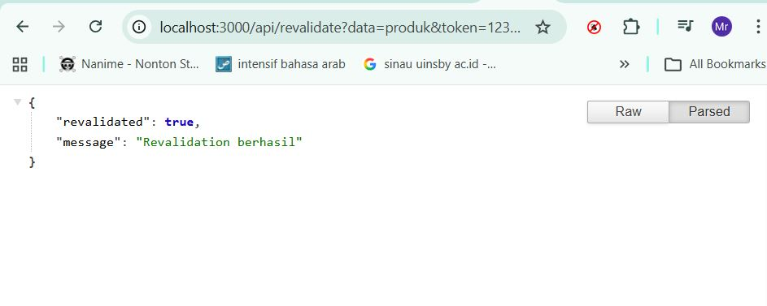
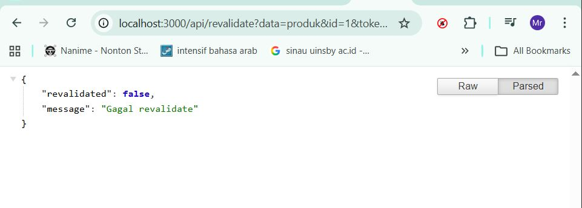
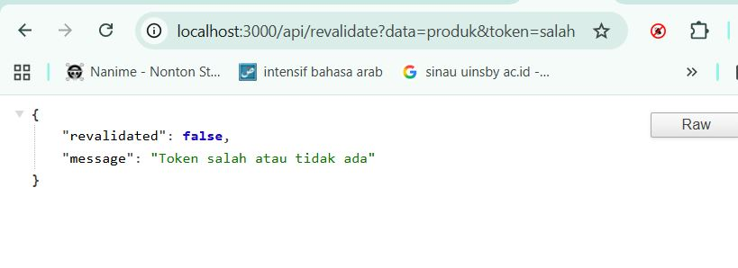
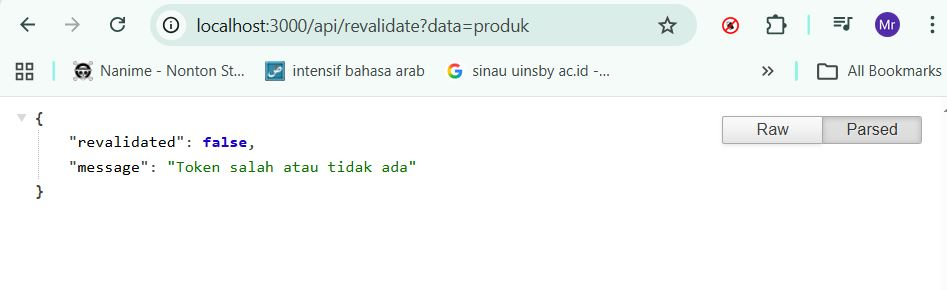

#  C. Implementasi ISR Otomatis 
# 📘 Lembar Kerja 12  
**Mata Kuliah:** Kerangka Pemrograman Berbasis Framework  
**Nama:** Fajru Santoso  

---

## 🧪 Hasil Praktikum

### 🔹   Bagian 1 – Tambahkan revalidate 

Pada langkah ini dibuat *catch-all route* untuk menangani berbagai URL dinamis dalam aplikasi Next.js.

#### 📸 Hasil Implementasi:

---

---

---

## 🧪 Hasil Praktikum

### 🔹    Bagian 2 – Pengujian ISR  

Pada langkah ini dibuat *catch-all route* untuk menangani berbagai URL dinamis dalam aplikasi Next.js.

#### 📸 Hasil Implementasi:

---

---

## 🧪 Hasil Praktikum

### 🔹    Bagian 2 – Pengujian ISR  

2. Tambahkan data baru di database pada firebase
   
#### 📸 Hasil Implementasi:

---

---

---

## 🧪 Hasil Praktikum

###  Bagian 2 – Tambahkan Parameter Data 

Untuk mengatasi hal tersebut ( pada bagian 1) maka suatu kondisi pada file revalidate.ts
   
#### 📸 Hasil Implementasi:

---

---

---

## 🧪 Hasil Praktikum

###   Bagian 3 – Tambahkan Token Security 

Perlu ditambahkan paramater agar user tidak merubah data melalui url 
   
#### 📸 Hasil Implementasi:

---

---

---

## 🧪 Hasil Praktikum

###    G. Tugas Praktikum 
## G. Tugas Praktikum

### Tugas Individu

1. Menambahkan data produk baru pada Firebase.
2. Mengimplementasikan Incremental Static Regeneration (ISR) dengan `revalidate: 10`.
3. Membuat endpoint **On-Demand Revalidation**.
4. Menambahkan validasi token pada endpoint revalidation.
5. Melakukan pengujian dengan beberapa kondisi:
   - **Token benar**
   - **Token salah**
   - **Tanpa token**
     
#### 📸 Hasil Implementasi:

---

---

## H. Pertanyaan Analisis

### 1. Mengapa ISR lebih fleksibel dibanding SSG?
ISR lebih fleksibel karena dapat memperbarui data tanpa perlu melakukan build ulang aplikasi, sedangkan SSG harus melakukan build ulang setiap ada perubahan data.

---

### 2. Apa perbedaan revalidate waktu dan on-demand?
- **Revalidate waktu**: Data diperbarui secara otomatis setelah interval waktu tertentu (misalnya 10 detik).
- **On-demand**: Data diperbarui secara manual melalui pemanggilan API kapan saja dibutuhkan.

---

### 3. Mengapa endpoint revalidation harus diamankan?
Agar tidak ada pihak luar yang dapat mengakses dan memicu revalidation secara sembarangan, yang dapat menyebabkan beban server meningkat atau perubahan data yang tidak diinginkan.

---

### 4. Apa risiko jika token tidak digunakan?
- Endpoint dapat diakses oleh siapa saja
- Rentan terhadap spam request (membebani server)
- Data bisa menjadi tidak terkontrol atau dimanipulasi

---

### 5. Kapan ISR lebih cocok dibanding SSR?
ISR lebih cocok digunakan ketika data tidak berubah secara real-time, tetapi tetap membutuhkan pembaruan secara berkala, seperti pada halaman produk atau artikel.

