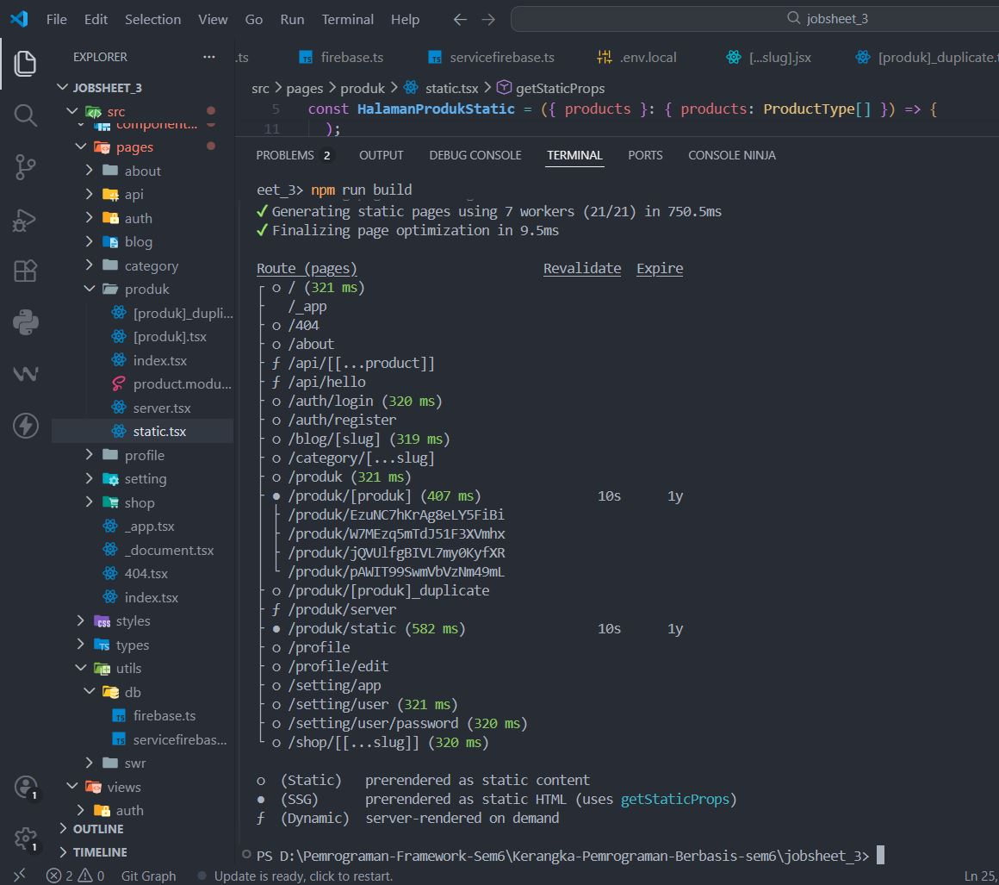
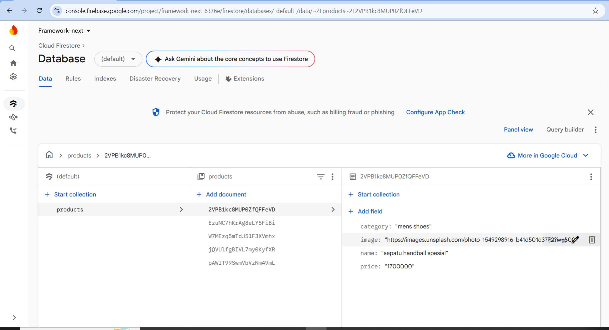
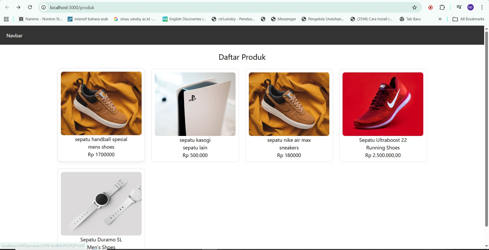

#  C. Implementasi ISR Otomatis 
# 📘 Lembar Kerja 12  
**Mata Kuliah:** Kerangka Pemrograman Berbasis Framework  
**Nama:** Fajru Santoso  

---

## 🧪 Hasil Praktikum

### 🔹   Bagian 1 – Tambahkan revalidate 

Pada langkah ini dibuat *catch-all route* untuk menangani berbagai URL dinamis dalam aplikasi Next.js.

#### 📸 Hasil Implementasi:

---

---

---

## 🧪 Hasil Praktikum

### 🔹    Bagian 2 – Pengujian ISR  

Pada langkah ini dibuat *catch-all route* untuk menangani berbagai URL dinamis dalam aplikasi Next.js.

#### 📸 Hasil Implementasi:

---

---

## 🧪 Hasil Praktikum

### 🔹    Bagian 2 – Pengujian ISR  

2. Tambahkan data baru di database pada firebase
   
#### 📸 Hasil Implementasi:

---

---

