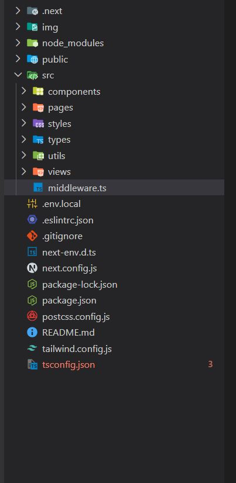
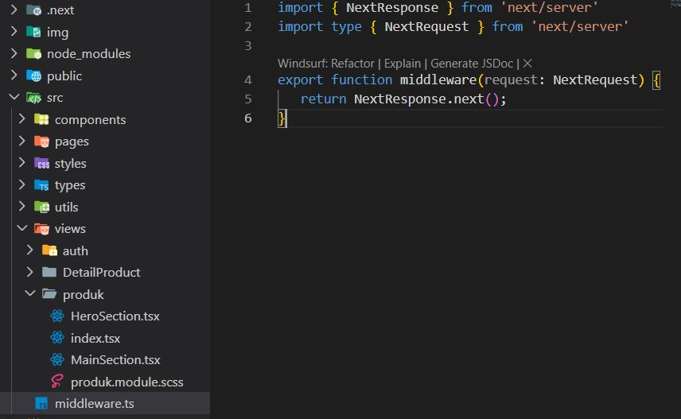
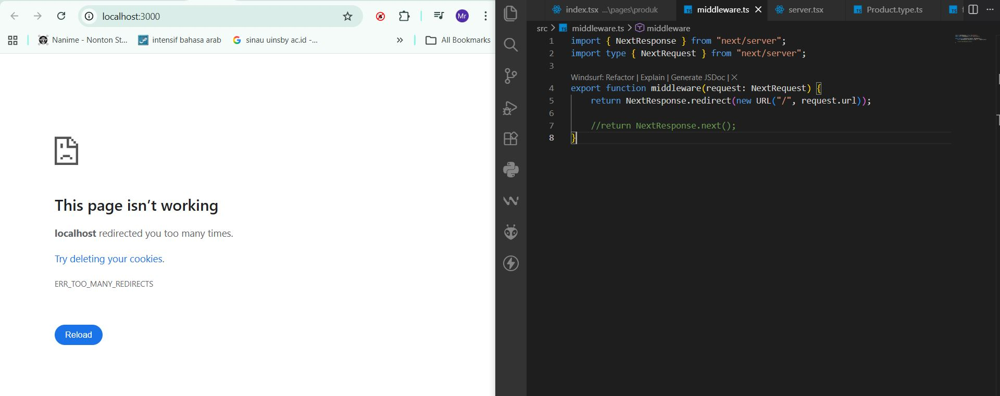
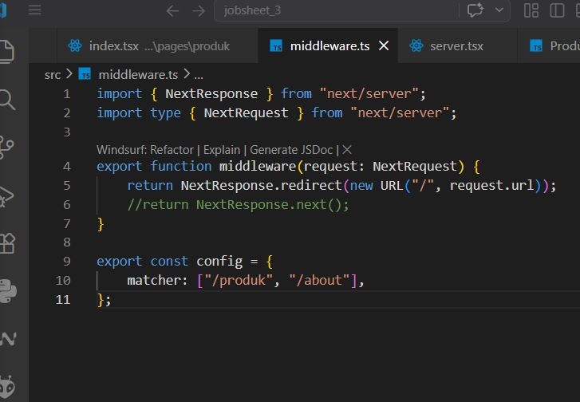
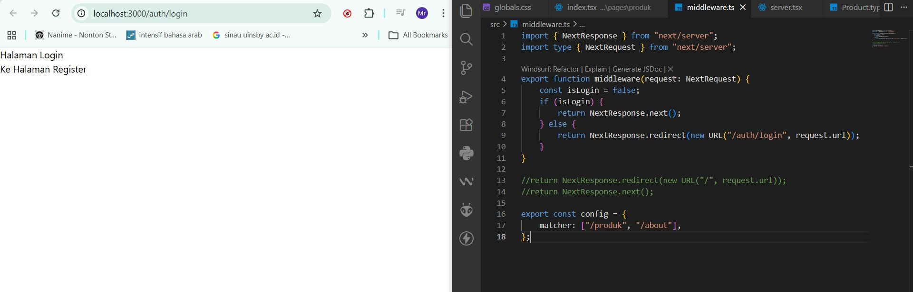

#  Middleware & Route Protection  
# 📘 Lembar Kerja 13 Middleware & Route Protection 
**Mata Kuliah:** Kerangka Pemrograman Berbasis Framework  
**Nama:** Fajru Santoso  

---

## 🧪 Hasil Praktikum

###  Bagian 1 – Membuat Middleware 

o Modifikasi file index.tsx pada folder src/pages/produk

#### 📸 Hasil Implementasi:


---


---


---

## 🧪 Hasil Praktikum

###   Bagian 2 – Struktur Dasar Middleware  

Pada langkah ini dibuat *catch-all route* untuk menangani berbagai URL dinamis dalam aplikasi Next.js.

#### 📸 Hasil Implementasi:


---


---


---

## 🧪 Hasil Praktikum

###    Bagian 3 – Redirect Sederhana 
  

o Semua halaman akan redirect ke home dan error dikarenakan terus menerus loading

#### 📸 Hasil Implementasi:


---


---


---

## 🧪 Hasil Praktikum

###     Bagian 4 – Batasi Route Tertentu  
  

o Untuk mengatasi pada bagian 3 maka perlu pembatasan route 

#### 📸 Hasil Implementasi:


---


---


---

## 🧪 Hasil Praktikum

###      Bagian 5 – Simulasi Sistem Login   
  

o Modifikasi file middleware.ts 
 Jika user langsung mengakses ke alamat http://localhost:3000/produk tidak akan bisa
user akan diarahkan ke halaman login

#### 📸 Hasil Implementasi:


---


---


## 🧪 D. Pengujian

### 🔹 Uji 1 – isLogin = false

**Konfigurasi:**

```ts
const isLogin = false;
```

**Akses:**

```
/products
```

**Hasil:**

* User akan di-redirect ke halaman `/login`

---

### 🔹 Uji 2 – isLogin = true

**Konfigurasi:**

```ts
const isLogin = true;
```

**Akses:**

```
/products
```

**Hasil:**

* User dapat mengakses halaman `/products`

---

### 🔹 Uji 3 – Multiple Route Protection

**Konfigurasi:**

```ts
export const config = {
  matcher: ["/products", "/about"],
};
```

**Hasil:**

* Halaman `/products` membutuhkan login
* Halaman `/about` membutuhkan login
* Halaman lain (misalnya `/login`) tetap dapat diakses tanpa login

#### 📸 Hasil Implementasi:


---


