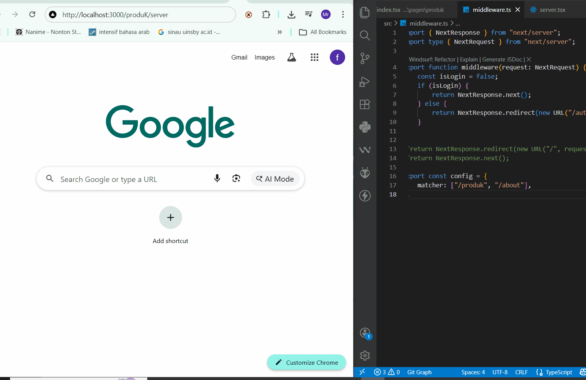
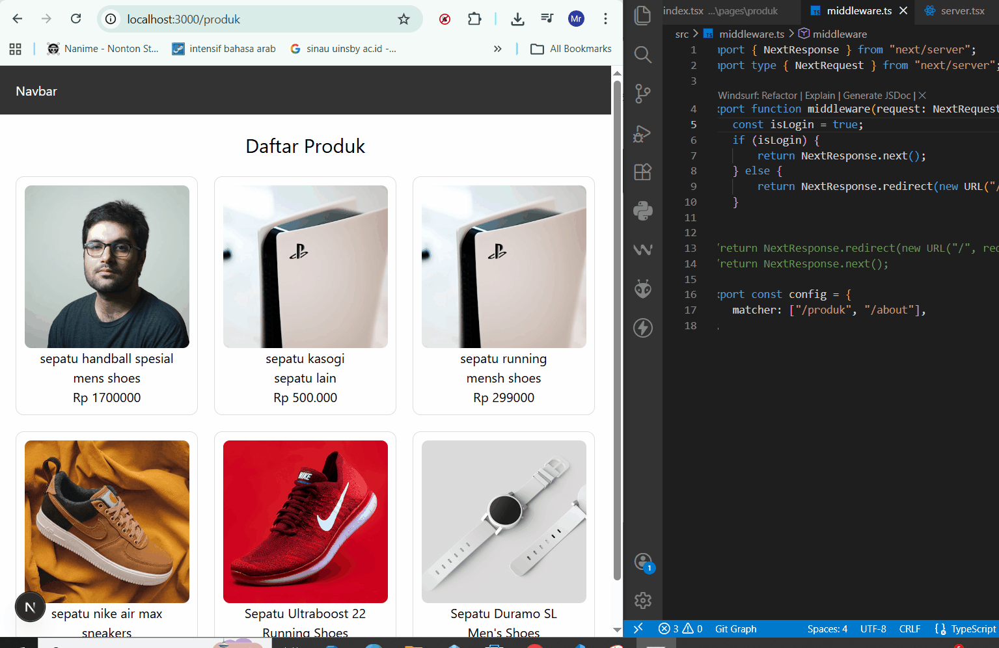
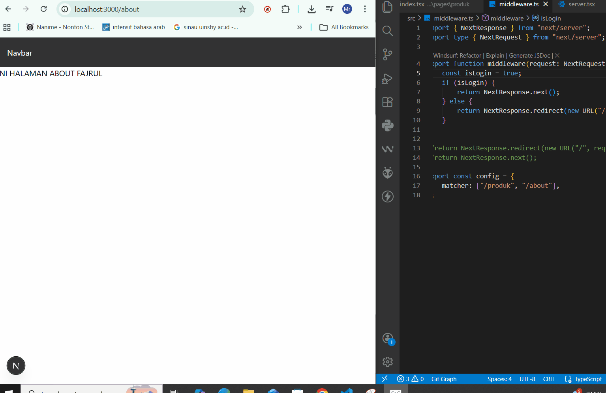

#  Middleware & Route Protection  
# 📘 Lembar Kerja 13 Middleware & Route Protection 
**Mata Kuliah:** Kerangka Pemrograman Berbasis Framework  
**Nama:** Fajru Santoso  

---

## 🧪 Hasil Praktikum

###  Bagian 1 – Membuat Middleware 

o Modifikasi file index.tsx pada folder src/pages/produk

#### 📸 Hasil Implementasi:


---


---


---

## 🧪 Hasil Praktikum

###   Bagian 2 – Struktur Dasar Middleware  

Pada langkah ini dibuat *catch-all route* untuk menangani berbagai URL dinamis dalam aplikasi Next.js.

#### 📸 Hasil Implementasi:


---


---


---

## 🧪 Hasil Praktikum

###    Bagian 3 – Redirect Sederhana 
  

o Semua halaman akan redirect ke home dan error dikarenakan terus menerus loading

#### 📸 Hasil Implementasi:


---


---


---

## 🧪 Hasil Praktikum

###     Bagian 4 – Batasi Route Tertentu  
  

o Untuk mengatasi pada bagian 3 maka perlu pembatasan route 

#### 📸 Hasil Implementasi:


---


---


---

## 🧪 Hasil Praktikum

###      Bagian 5 – Simulasi Sistem Login   
  

o Modifikasi file middleware.ts 
 Jika user langsung mengakses ke alamat http://localhost:3000/produk tidak akan bisa
user akan diarahkan ke halaman login

#### 📸 Hasil Implementasi:


---


---


## 🧪 D. Pengujian

### 🔹 Uji 1 – isLogin = false

**Konfigurasi:**

```ts
const isLogin = false;
```

**Akses:**

```
/products
```

**Hasil:**

* User akan di-redirect ke halaman `/login`

---

### 🔹 Uji 2 – isLogin = true

**Konfigurasi:**

```ts
const isLogin = true;
```

**Akses:**

```
/products
```

**Hasil:**

* User dapat mengakses halaman `/products`

---

### 🔹 Uji 3 – Multiple Route Protection

**Konfigurasi:**

```ts
export const config = {
  matcher: ["/products", "/about"],
};
```

**Hasil:**

* Halaman `/products` membutuhkan login
* Halaman `/about` membutuhkan login
* Halaman lain (misalnya `/login`) tetap dapat diakses tanpa login

#### 📸 Hasil Implementasi:




---


## 🧩 F. Tugas Praktikum

### 🎯 Tugas Individu

1. **Membuat Halaman**

   * `/products`
   * `/about`
   * `/login`

2. **Implementasi Middleware**

   * Redirect ke `/login` jika user belum login
   * Mengizinkan akses jika `isLogin = true`

3. **Proteksi Route Tertentu**

   * Middleware hanya berlaku untuk halaman tertentu (misalnya `/products` dan `/about`)

4. **Dokumentasi**
#### 📸 Hasil Implementasi:


---

---

## 🧠 G. Pertanyaan Analisis

### 1. Mengapa middleware lebih aman dibanding useEffect?

Middleware berjalan di server sebelum halaman dirender, sehingga user tidak sempat mengakses atau melihat konten jika belum login. Sedangkan useEffect berjalan di client setelah halaman tampil.

---

### 2. Mengapa middleware tidak menimbulkan glitch?

Karena proses redirect dilakukan sebelum halaman ditampilkan, sehingga tidak terjadi efek “muncul lalu hilang” seperti pada useEffect.

---

### 3. Apa risiko jika semua halaman diproteksi tanpa pengecualian?

* Terjadi infinite redirect (loop)
* Halaman login ikut terproteksi sehingga tidak bisa diakses
* Aplikasi menjadi tidak dapat digunakan

---

### 4. Kapan middleware tidak diperlukan?

* Jika hanya membutuhkan redirect sederhana
* Jika tidak ada sistem autentikasi
* Pada aplikasi kecil yang tidak memerlukan proteksi halaman

---

### 5. Apa perbedaan middleware dan API route?

| Middleware                          | API Route                                |
| ----------------------------------- | ---------------------------------------- |
| Berjalan sebelum request diproses   | Endpoint backend                         |
| Digunakan untuk proteksi & redirect | Digunakan untuk logic server (CRUD, dll) |
| Tidak menghasilkan response data    | Menghasilkan response (JSON, dll)        |

---


