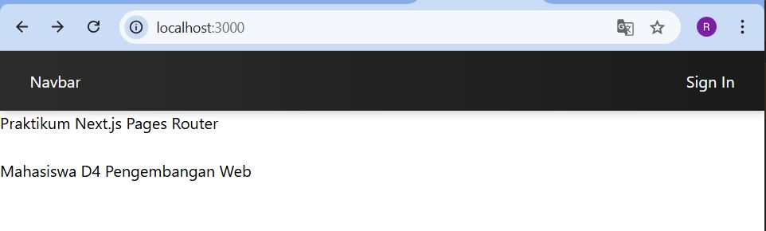
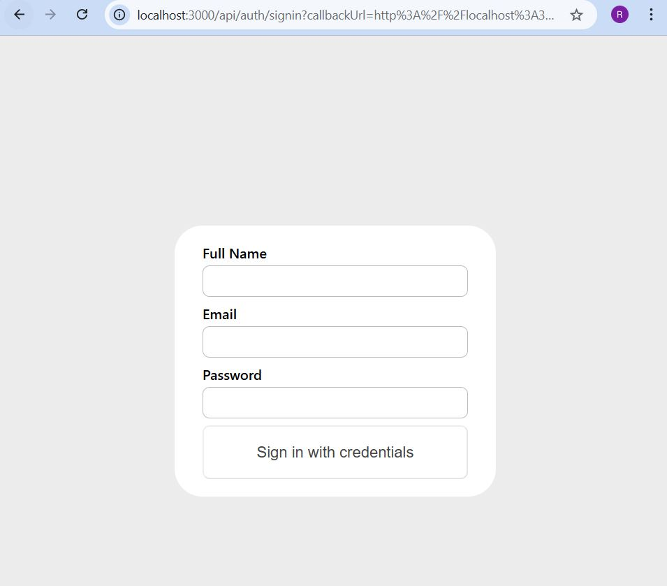
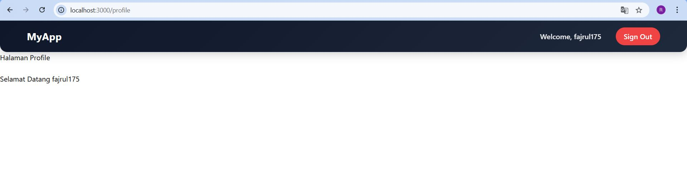
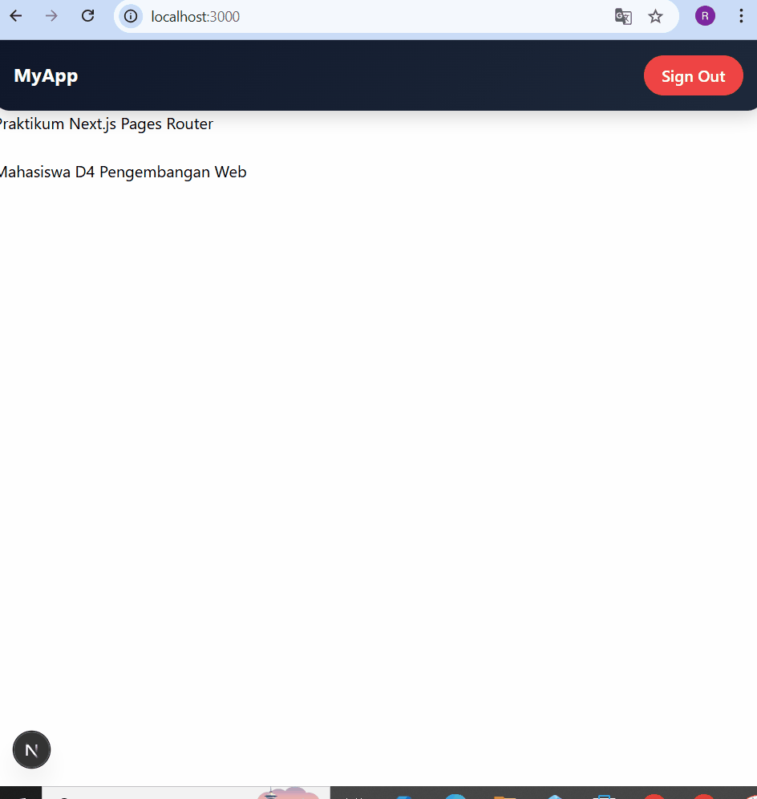
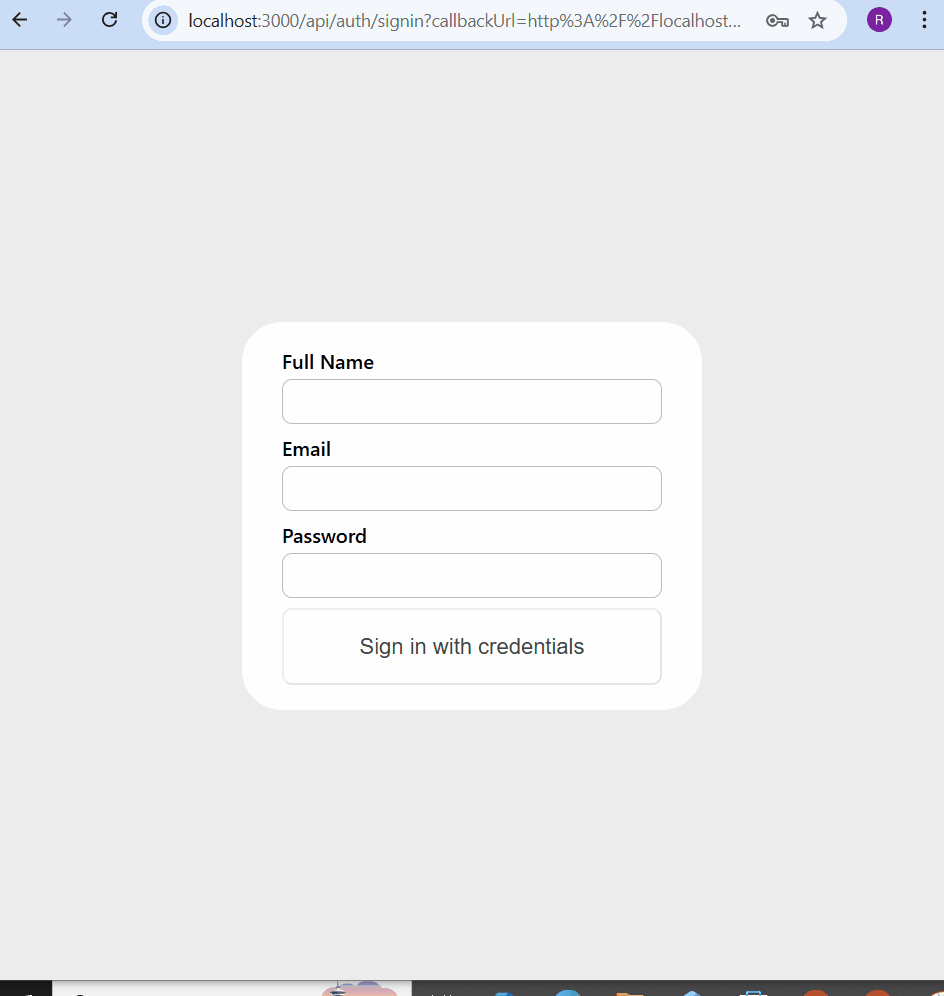
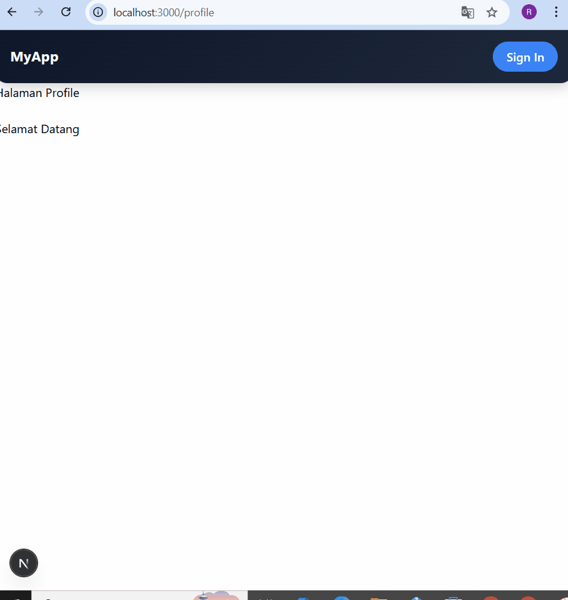

#  Middleware & Route Protection  
# 📘 Lembar Kerja 14 Topik: Implementasi Login dengan NextAuth 
**Mata Kuliah:** Kerangka Pemrograman Berbasis Framework  
**Nama:** Fajru Santoso  

---

## 🧪 Hasil Praktikum

###   Bagian 1 – Install NextAuth  

#### 📸 Hasil Implementasi:

---

---

## 🧪 Hasil Praktikum

###    Bagian 5 – Tambahkan Tombol Login & Logout   

#### 📸 Hasil Implementasi:

--- 

---

## 🧪 Hasil Praktikum

###     D. Menambahkan Data Tambahan (Full Name)    

#### 📸 Hasil Implementasi:

---

---

## 🧪 Hasil Praktikum

###      E. Proteksi Halaman Profile     

#### 📸 Hasil Implementasi:

---

---

## 🧪 Hasil Praktikum

## 🧪 F. Pengujian

| No | Skenario           | Langkah Akses                                      | Hasil yang Diharapkan        | Hasil Aktual                  |
|----|-------------------|----------------------------------------------------|------------------------------|-------------------------------|
| 1  | Belum Login       | Akses `/profile`                                   | Redirect ke halaman home     | ✅ Redirect ke home           |
| 2  | Sudah Login       | Login → Akses `/profile`                           | Bisa masuk ke halaman        | ✅ Berhasil masuk             |
| 3  | Logout            | Klik Sign Out → Akses `/profile`                   | Tidak bisa mengakses halaman | ✅ Akses ditolak              |
#### 📸 Hasil Implementasi:

---

## 📚 H. Tugas Praktikum

| No | Tugas                                                                 | Keterangan                          |
|----|----------------------------------------------------------------------|------------------------------------|
| 1  | Implementasikan login menggunakan **Credentials Provider**           | Autentikasi user                   |
| 2  | Tambahkan field **Full Name**                                        | Input data tambahan user           |
| 3  | Tampilkan **Full Name** setelah login                                | Menampilkan data session           |
| 4  | Buat halaman **Profile**                                             | Halaman khusus user                |
| 5  | Lindungi halaman **Profile** dengan middleware                       | Proteksi route                     |

---

### 🧾 Dokumentasi

| No | Jenis Screenshot              | Keterangan                      |
|----|-------------------------------|--------------------------------|
| 1  | Screenshot Login              | Tampilan halaman login         |
| 2  | Screenshot Session            | Data session setelah login     |
| 3  | Screenshot Redirect Middleware| Proses redirect saat akses     |

#### 📸 Hasil Implementasi:

---

## ❓ G. Pertanyaan Analisis

| No | Pertanyaan                                           | Jawaban                                                                                     |
|----|------------------------------------------------------|---------------------------------------------------------------------------------------------|
| 1  | Mengapa session menggunakan JWT?                     | JWT bersifat stateless, sehingga tidak perlu menyimpan session di server dan lebih efisien |
| 2  | Apa perbedaan authorize() dan callback jwt()?        | authorize() untuk validasi login user, sedangkan jwt() untuk menyimpan/mengelola data token|
| 3  | Mengapa middleware perlu getToken()?                 | Untuk mengambil dan mengecek token user apakah sudah login atau belum                      |
| 4  | Apa risiko jika NEXTAUTH_SECRET tidak digunakan?     | Token bisa dipalsukan atau dimanipulasi sehingga sistem tidak aman                         |
| 5  | Apa perbedaan autentikasi dan otorisasi?             | Autentikasi: verifikasi identitas, Otorisasi: pemberian hak akses setelah login            |

