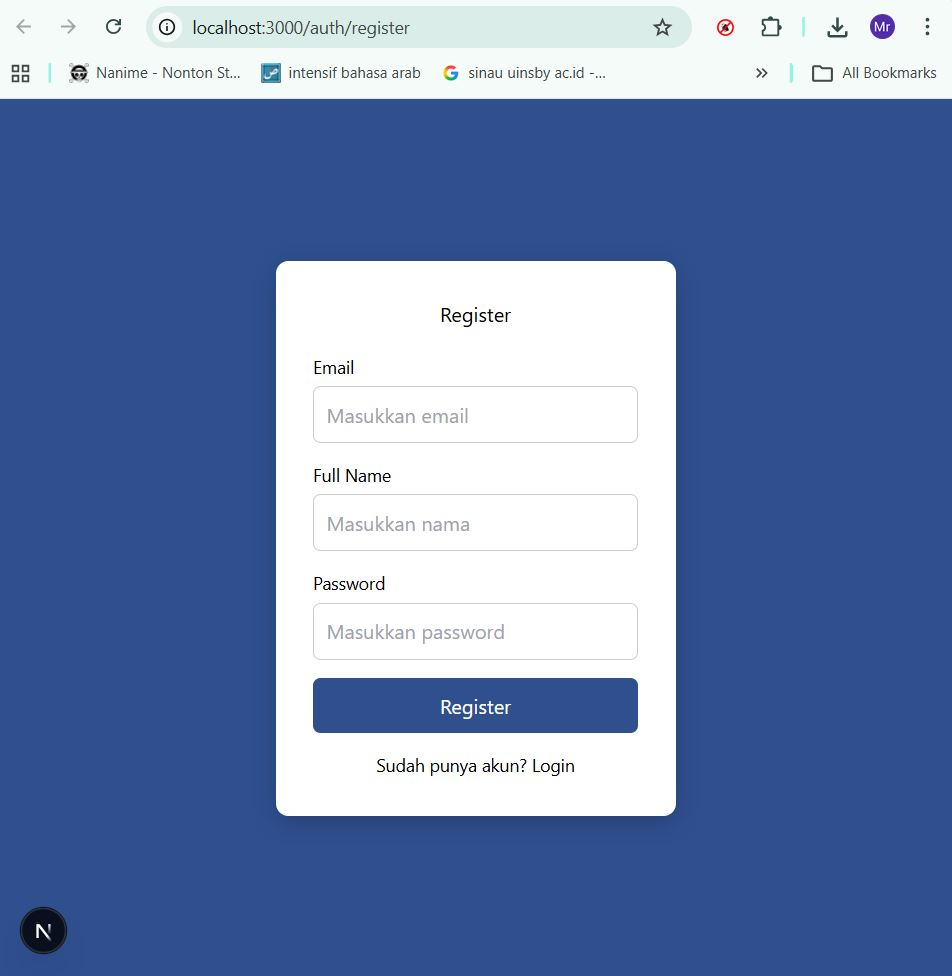

#  Middleware & Route Protection  
# 📘 Lembar Kerja 15 Topik: Pertemuan: Implementasi Sistem Registrasi (Database Integration)  
**Mata Kuliah:** Kerangka Pemrograman Berbasis Framework  
**Nama:** Fajru Santoso  

---

## 🧪 Hasil Praktikum

###    Bagian 1 – Membuat Register View   

#### 📸 Hasil Implementasi:

---

