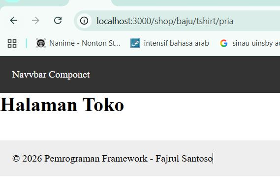
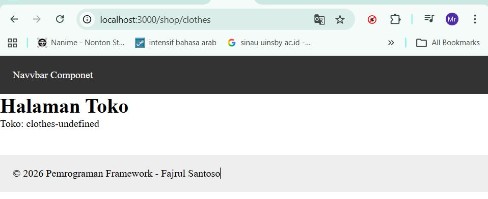
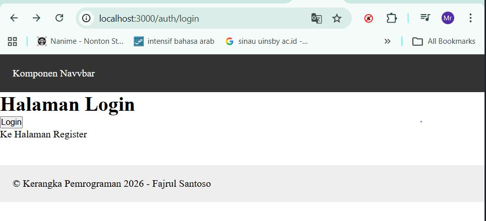

# 📘 Lembar Kerja 4  
**Mata Kuliah:** Kerangka Pemrograman Berbasis Framework  
**Nama:** Fajru Santoso  

---

## 🧪 Hasil Praktikum

### 🔹 Langkah 2 – Membuat Catch-All Route
Pada langkah ini dibuat *catch-all route* untuk menangani berbagai URL dinamis dalam aplikasi Next.js.

#### 📸 Hasil Implementasi:

---

### 🔹 Langkah 3 – Pengujian Catch-All Route

Pengujian dilakukan dengan mengakses URL berikut:
/shop/clothes
/shop/clothes/tops
/shop/clothes/tops/t-shirt

## Jalankan browser : Berapapun banyaknya seqment tetap terbaca 

## Langkah 4  Optional Catch-All Route

 
## Langkah 5 – Validasi Parameter
## Langkah 6 – Membuat Halaman Login & Register

# 📌 E. Tugas Praktikum

## 1. Tugas Wajib

### **1.1 Tugas 1 – Catch-All Route**

| Keterangan | Detail |
|------------|--------|
| Deskripsi | Membuat catch-all route untuk menangani parameter URL dinamis |
| Path | `/category/[...slug].js` |
| Output | Menampilkan seluruh parameter URL dalam bentuk **list** |

|Catch-all route dibuat dengan file [...slug].jsx untuk menangkap banyak parameter URL.|
|Parameter URL disimpan dalam bentuk array dan ditampilkan di halaman category.|

---

### **1.2 Tugas 2 – Navigasi Halaman**

| Navigasi | Metode | Keterangan |
|-----------|----------|-------------|

| Login → Product | Imperatif | Menggunakan router.push() |
| Login ↔ Register | Deklaratif | Menggunakan Link |
| Navigasi login ke product dibuat menggunakan router.push() (imperatif).|
Navigasi antara login dan register dibuat menggunakan Link (deklaratif). |

---

## 2. Tugas Pengayaan

### **2.1 Tugas 3 – Redirect Otomatis Login**

| Keterangan | Detail |
|------------|--------|
| Deskripsi | Redirect otomatis ke halaman login jika user belum login |
| Implementasi | Middleware / Auth Guard |
 
---

# ❓ F. Pertanyaan Evaluasi

| No | Pertanyaan |
|----|------------|
| 1 | Apa perbedaan `[id].js` dan `[...slug].js`? |
| 2 | Mengapa slug berbentuk array? |
| 3 | Kapan sebaiknya menggunakan `Link` dan `router.push()`? |
| 4 | Mengapa navigasi Next.js tidak me-refresh halaman? |

---
