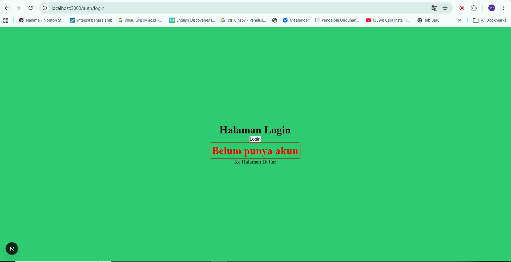
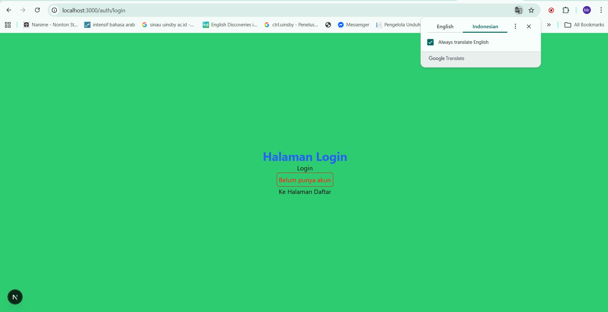
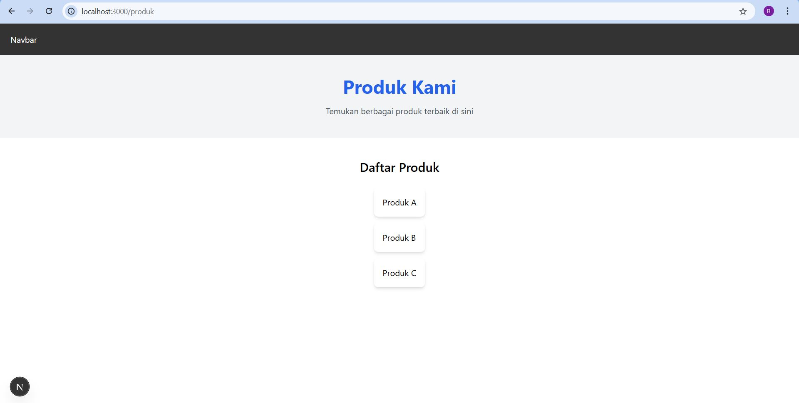

# 📘 Lembar Kerja 5  
**Mata Kuliah:** Kerangka Pemrograman Berbasis Framework  
**Nama:** Fajru Santoso  

---

## 🧪 Hasil Praktikum

### 🔹 Langkah 2 – CSS Module (Local Scope)

#### 📸 Hasil Implementasi:

---

---

## 🧪 Hasil Praktikum

### 🔹 3. Styling untuk Pages (CSS Module)

#### 📸 Hasil Implementasi:

---

## 🧪 Hasil Praktikum

### 🔹4. Conditional Rendering Navbar (Tanpa Navbar di Login)

#### 📸 Hasil Implementasi:

---

---

## 🧪 Hasil Praktikum

### 5. Refactoring Struktur Project (Best Practice)

#### 📸 Hasil Implementasi:

---

## 🧪 Hasil Praktikum

### 6. Inline Styling (CSS-in-JS)

#### 📸 Hasil Implementasi:

---

## 🧪 Hasil Praktikum

### 8. SCSS (SASS)

#### 📸 Hasil Implementasi:

---

## 🧪 Hasil Praktikum

### Tugas 1 • Buat halaman Register • Gunakan CSS Module 

#### 📸 Hasil Implementasi:

---

## 🧪 Hasil Praktikum

### Tugas 2 • Refactor halaman Produk ke folder views • Pisahkan Hero Section dan Main Section struktur folder nya 

#### 📸 Hasil Implementasi:

---

## 🧪 Hasil Praktikum

### Tugas 3 • Terapkan Tailwind CSS • Gunakan minimal 5 utility class

#### 📸 Hasil Implementasi:

---

# Refleksi CSS & Styling Frontend

---

## 1. Kapan sebaiknya menggunakan CSS Module dibanding Global CSS?

- **CSS Module** digunakan ketika styling hanya berlaku untuk **satu komponen tertentu**.  
  Tujuannya agar **tidak terjadi konflik** antar class di seluruh aplikasi.

- **Global CSS** digunakan untuk styling yang berlaku **di seluruh aplikasi**, seperti:  
  - Reset CSS  
  - Utility global  
  - Styling layout umum  

---

## 2. Apa kelemahan inline styling?

- Tidak **reusable** (tidak bisa digunakan di komponen lain dengan mudah).  
- Sulit **dikelola** pada project besar.  
- Tidak mendukung **pseudo-class** seperti `:hover` atau `:focus`.  
- Membuat kode **JSX kurang rapi** karena styling bercampur dengan markup.  

---

## 3. Mengapa SCSS cocok untuk project skala besar?

- Mendukung **variable**, sehingga warna, ukuran, atau spacing bisa digunakan konsisten.  
- Mendukung **nesting**, membuat kode lebih **terstruktur**.  
- Mendukung **modularisasi** melalui partial dan import, sehingga kode lebih mudah **dikelola** dan **scalable** untuk pengembangan jangka panjang.  

---

## 4. Apa keunggulan Tailwind dibanding CSS tradisional?

- Mempercepat pengembangan karena menggunakan **utility class** langsung di HTML/JSX.  
- Menjaga styling tetap **konsisten** di seluruh aplikasi.  
- Tidak perlu membuat **file CSS terpisah** untuk setiap komponen.  
- Cocok untuk prototyping cepat sekaligus tetap terstruktur.  

---

