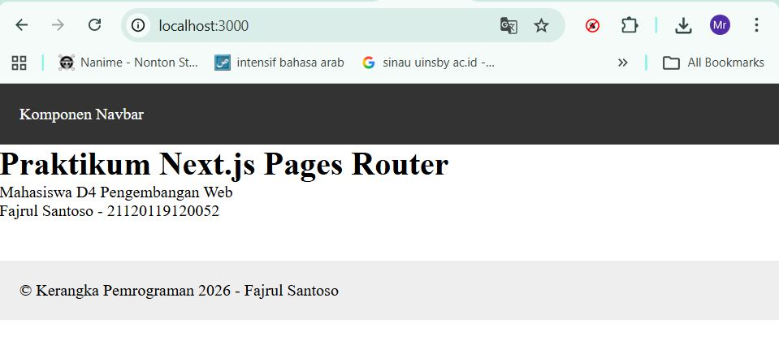
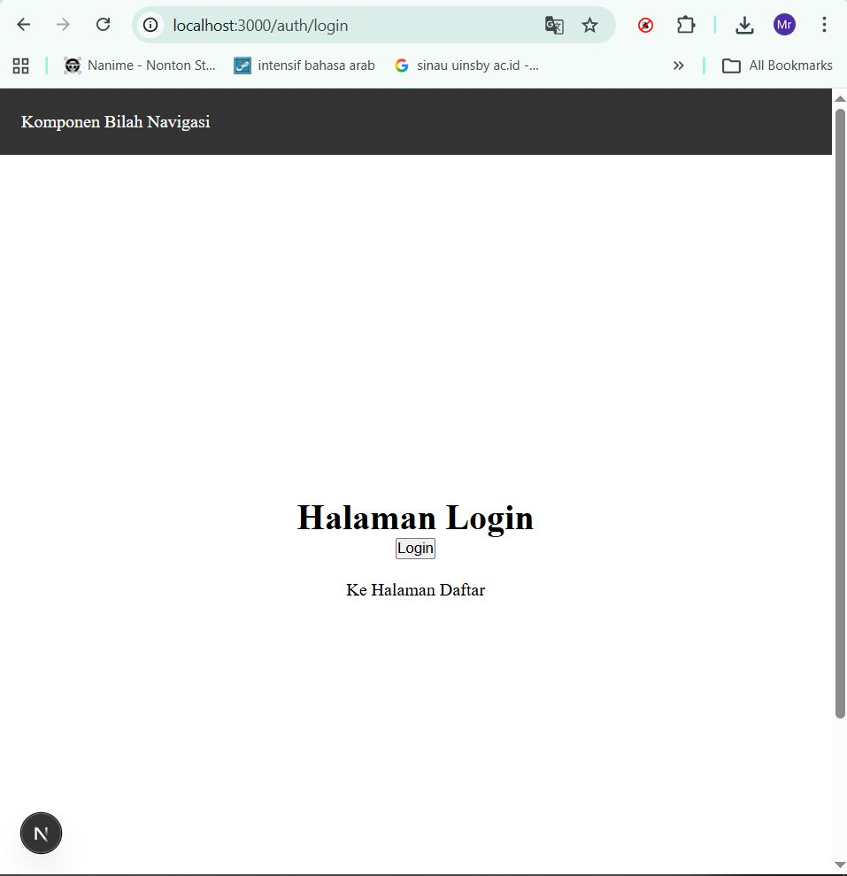
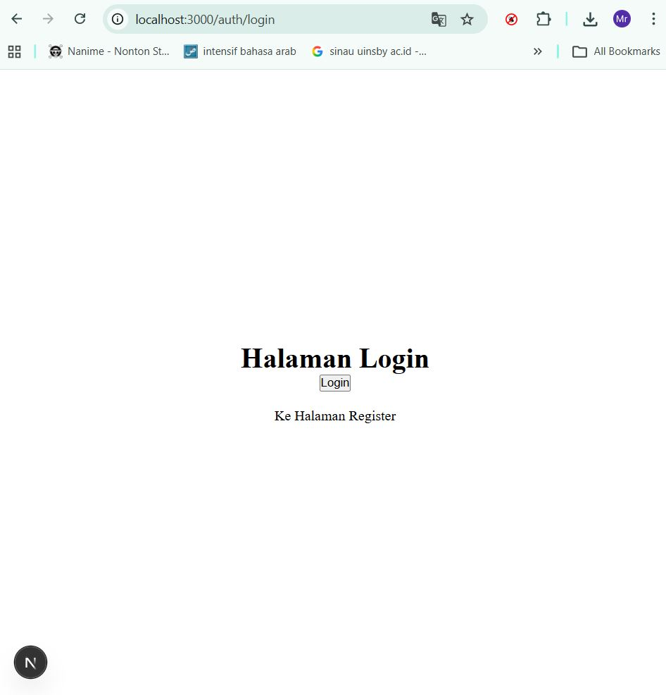
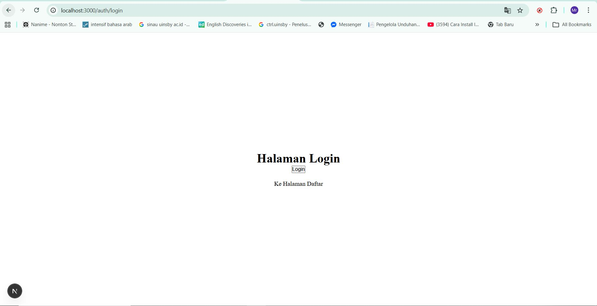
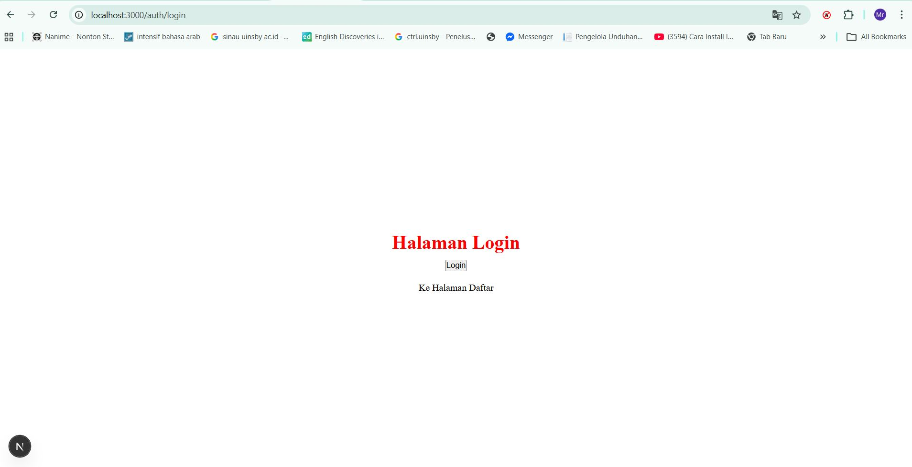

# 📘 Lembar Kerja 5  
**Mata Kuliah:** Kerangka Pemrograman Berbasis Framework  
**Nama:** Fajru Santoso  

---

## 🧪 Hasil Praktikum

### 🔹 Langkah 2 – CSS Module (Local Scope)

#### 📸 Hasil Implementasi:

---

---

## 🧪 Hasil Praktikum

### 🔹 3. Styling untuk Pages (CSS Module)

#### 📸 Hasil Implementasi:

---

## 🧪 Hasil Praktikum

### 🔹4. Conditional Rendering Navbar (Tanpa Navbar di Login)

#### 📸 Hasil Implementasi:

---

---

## 🧪 Hasil Praktikum

### 5. Refactoring Struktur Project (Best Practice)

#### 📸 Hasil Implementasi:

---

## 🧪 Hasil Praktikum

### 6. Inline Styling (CSS-in-JS)

#### 📸 Hasil Implementasi:

---

