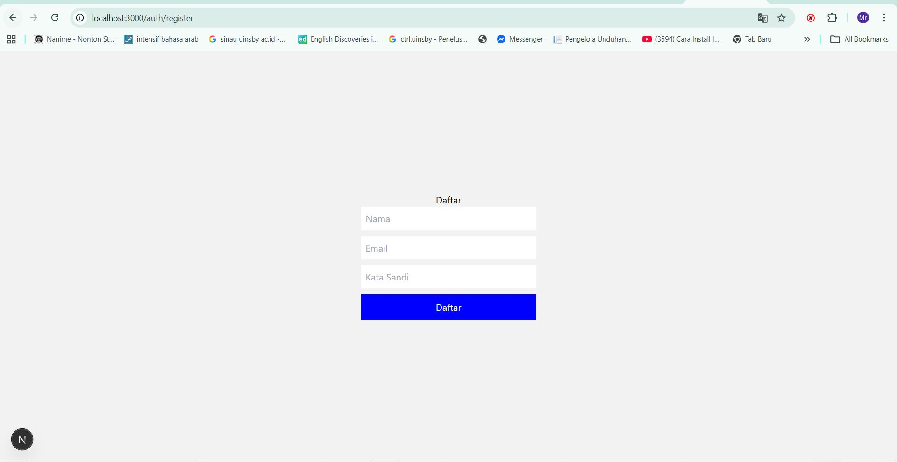
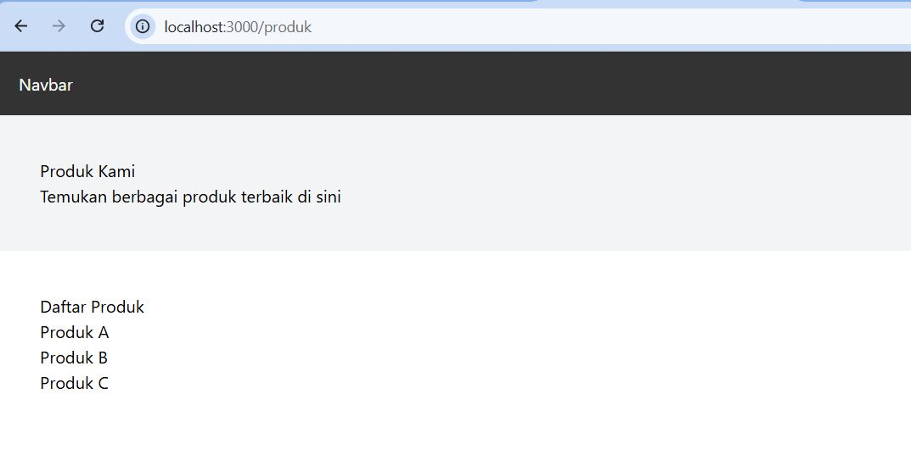

# 📘 Lembar Kerja 6 
**Mata Kuliah:** Kerangka Pemrograman Berbasis Framework  
**Nama:** Fajru Santoso  

---

## 🧪 Hasil Praktikum

### 🔹 Langkah 3 – Pengaturan Title per Halaman

#### 📸 Hasil Implementasi:

---

---

---

## 🧪 Hasil Praktikum

### 🔹 Langkah 4 – Membuat Custom Error Page (404)

#### 📸 Hasil Implementasi:

---

---

---

## 🧪 Hasil Praktikum

### 🔹Langkah 5 – Styling Halaman 404

#### 📸 Hasil Implementasi:

---

---

---

## 🧪 Hasil Praktikum

### 🔹Langkah 6 – Menampilkan Gambar dari Folder Public

#### 📸 Hasil Implementasi:

---

---

## 🧪 Hasil Praktikum

E. Tugas Praktikum Tugas 1 (Wajib) •
Tambahkan:
o Judul halaman
o Deskripsi singkat
o Gambar ilustrasi

#### 📸 Hasil Implementasi:

---

---

## 🧪 Hasil Praktikum

Tugas 2 (Wajib)
• Custom warna, font, dan layout halaman 404
• Navbar tidak tampil di halaman 404
Hasil 

#### 📸 Hasil Implementasi:

---

---

---

## 🧪 Hasil Praktikum

Tugas 3 (Pengayaan)
• Tambahkan tombol: o “Kembali ke Home”
• Gunakan navigasi Next.js (Link)

#### 📸 Hasil Implementasi:

---

---

