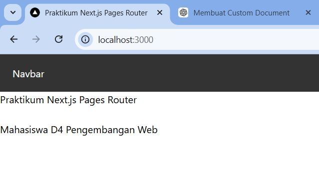
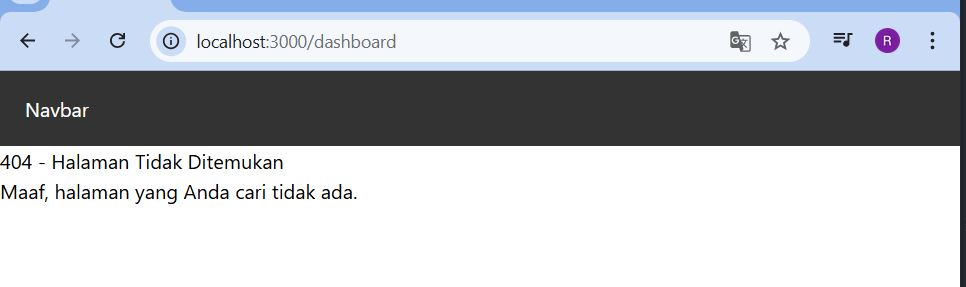
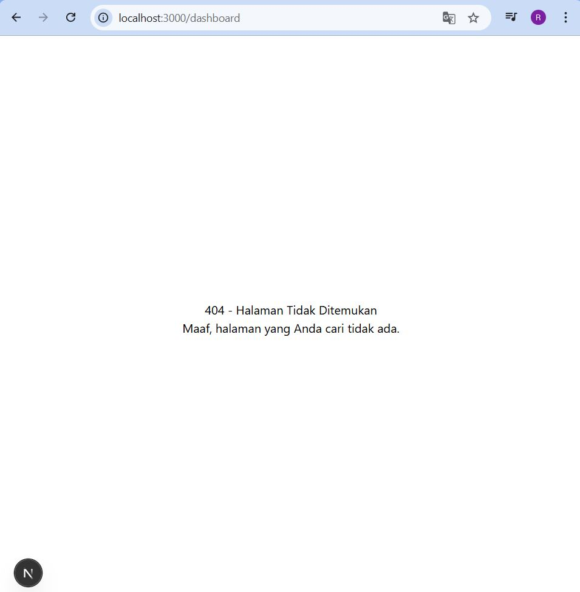
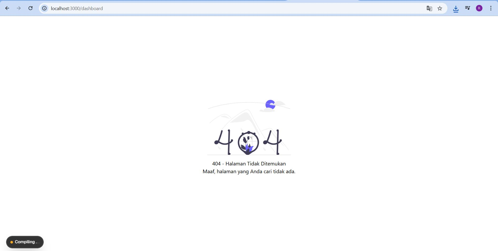

# 📘 Lembar Kerja 6 
**Mata Kuliah:** Kerangka Pemrograman Berbasis Framework  
**Nama:** Fajru Santoso  

---

## 🧪 Hasil Praktikum

### 🔹 Langkah 3 – Pengaturan Title per Halaman

#### 📸 Hasil Implementasi:

---

---

---

## 🧪 Hasil Praktikum

### 🔹 Langkah 4 – Membuat Custom Error Page (404)

#### 📸 Hasil Implementasi:

---

---

---

## 🧪 Hasil Praktikum

### 🔹Langkah 5 – Styling Halaman 404

#### 📸 Hasil Implementasi:

---

---

---

## 🧪 Hasil Praktikum

### 🔹Langkah 6 – Menampilkan Gambar dari Folder Public

#### 📸 Hasil Implementasi:

---

---

