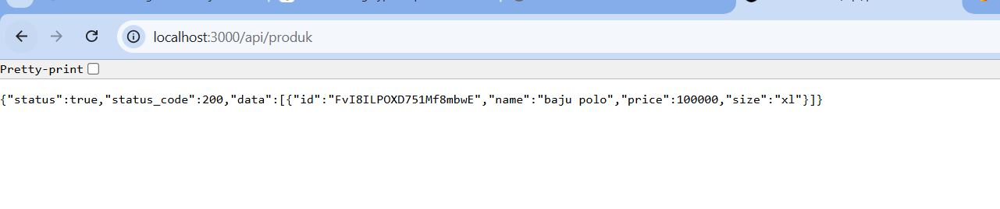
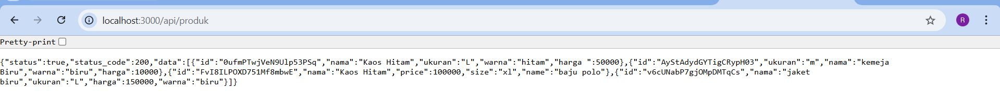
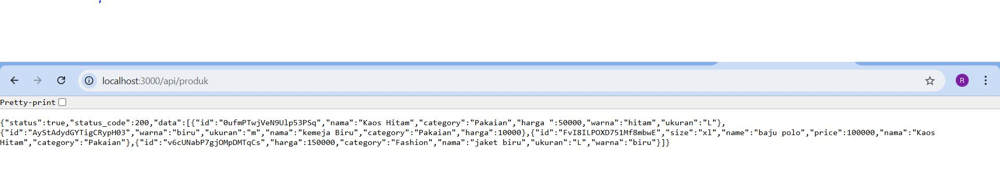
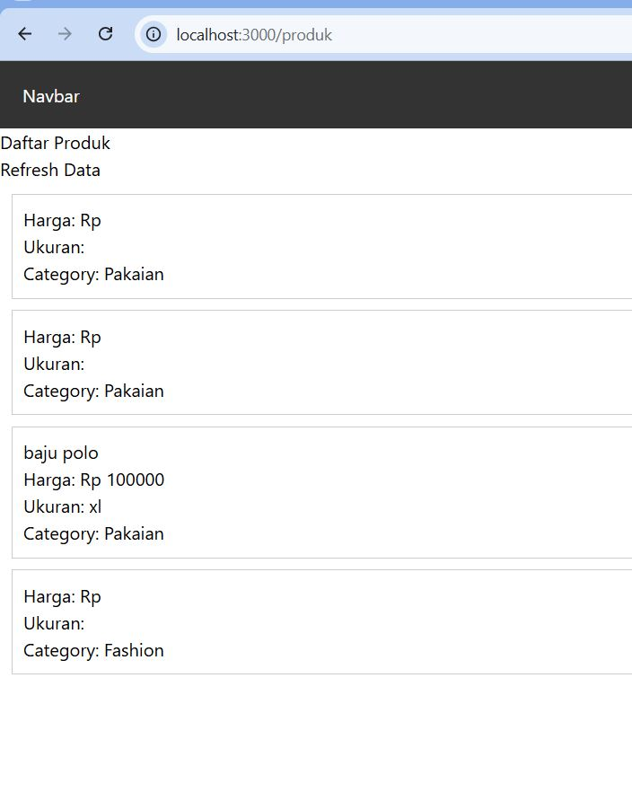
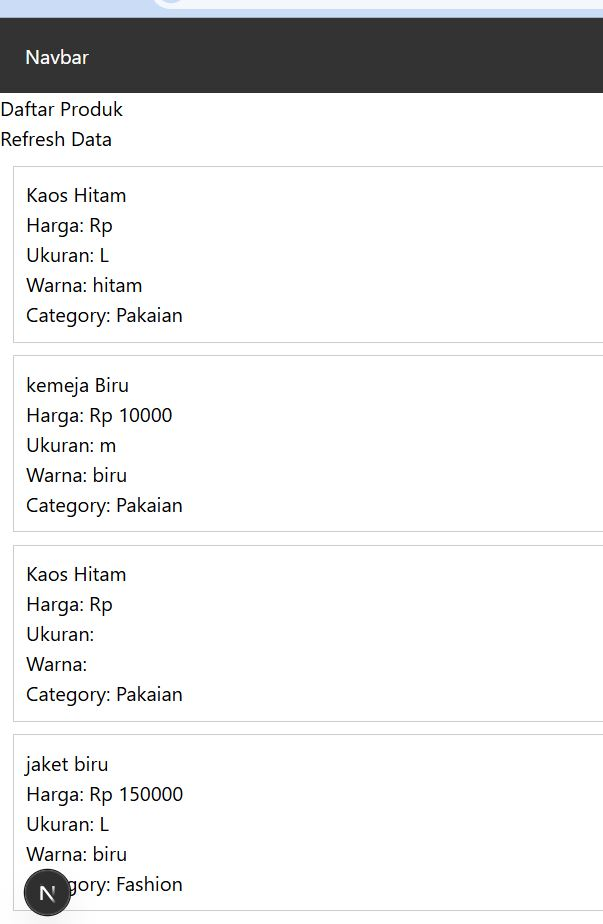

# 📘 Lembar Kerja 7  
**Mata Kuliah:** Kerangka Pemrograman Berbasis Framework  
**Nama:** Fajru Santoso  

---

## 🧪 Hasil Praktikum

### Langkah 2 – Membuat API Produk

#### 📸 Hasil Implementasi:

---

---

## 🧪 Hasil Praktikum

### Langkah 3 – Fetch Data API di Frontend

#### 📸 Hasil Implementasi:

---

---

---

---

## 🧪 Hasil Praktikum

### Langkah 10 – API Mengambil Data Firebase 

#### 📸 Hasil Implementasi:

---

---

## 🧪   TUGAS PRAKTIKUM

### Tugas 1 (Wajib) • Tambahkan minimal 3 data produk di Firestore • Pastikan data tampil di halaman produk 

#### 📸 Hasil Implementasi:

---

---

## 🧪   TUGAS PRAKTIKUM

### Tugas 2 (Wajib) • Tambahkan field baru: o category • Tampilkan category di frontend  

#### 📸 Hasil Implementasi:

---

---

## 🧪   TUGAS PRAKTIKUM

### Tugas 3 (Pengayaan) • Tambahkan tombol Refresh Data • Gunakan fetch ulang tanpa reload halaman  

#### 📸 Hasil Implementasi:

---

