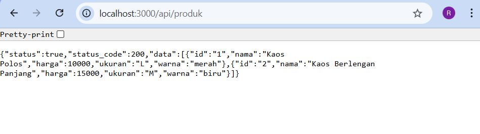
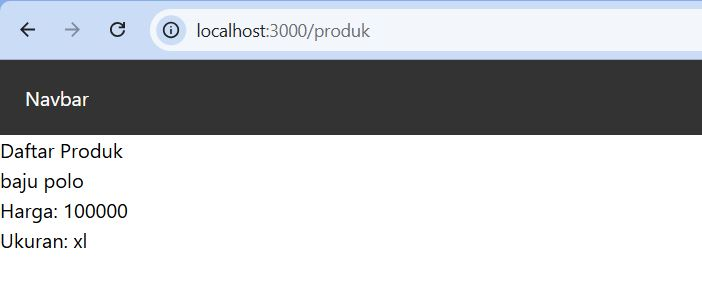
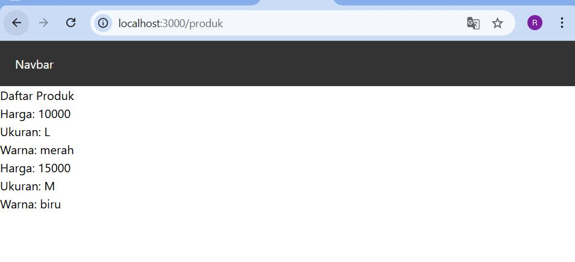

# 📘 Lembar Kerja 7  
**Mata Kuliah:** Kerangka Pemrograman Berbasis Framework  
**Nama:** Fajru Santoso  

---

## 🧪 Hasil Praktikum

### Langkah 2 – Membuat API Produk

#### 📸 Hasil Implementasi:

---

---

## 🧪 Hasil Praktikum

### Langkah 3 – Fetch Data API di Frontend

#### 📸 Hasil Implementasi:

---

---

## 🧪 Hasil Praktikum

### E. Integrasi Firebase Langkah 5 – Setup Firebase

#### 📸 Hasil Implementasi:

---

---

## 🧪 Hasil Praktikum

### Langkah 10 – API Mengambil Data Firebase 

#### 📸 Hasil Implementasi:

---

