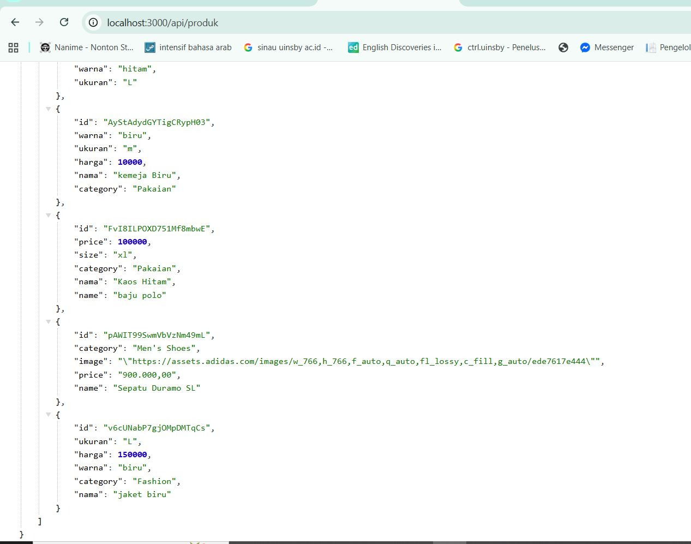
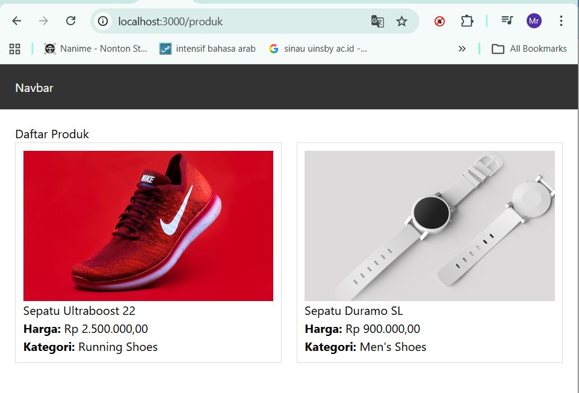
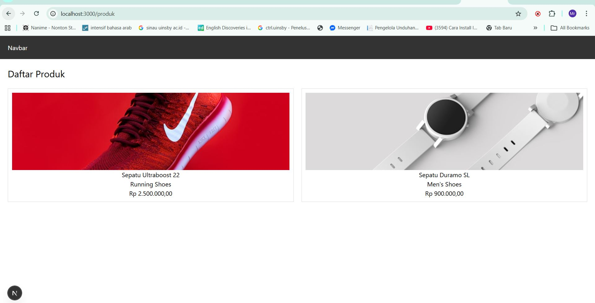
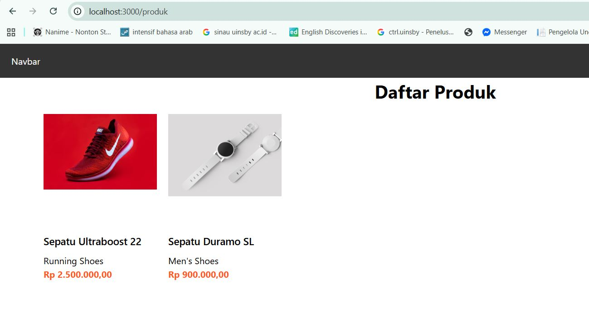

# 📘 Lembar Kerja 8
**Mata Kuliah:** Kerangka Pemrograman Berbasis Framework  
**Nama:** Fajru Santoso  

---

## 🧪 Hasil Praktikum

###  Bagian 1 – Setup Data Produk

#### 📸 Hasil Implementasi:

---

---

---

## 🧪 Hasil Praktikum

###   Bagian 2 – Implementasi CSR dengan useEffect

#### 📸 Hasil Implementasi:

---

---

---

## 🧪 Hasil Praktikum

###    Bagian 3 – Implementasi Skeleton Loading

#### 📸 Hasil Implementasi:

---

---

# Tugas Praktikum – Perbedaan CSR, SSR, dan SSG

## 1. Client Side Rendering (CSR)

Client Side Rendering adalah metode rendering dimana **data diambil dan diproses di browser (client)** setelah halaman dimuat. Halaman akan tampil terlebih dahulu, kemudian data dimuat menggunakan JavaScript.

### Ciri-ciri

* Data diambil di browser
* Skeleton / loading biasanya muncul
* Interaksi halaman lebih dinamis

## 2. Server Side Rendering (SSR)

Server Side Rendering adalah metode rendering dimana **data diambil di server terlebih dahulu sebelum halaman dikirim ke browser**. Saat halaman dibuka, data sudah tersedia.

### Ciri-ciri

* Data diambil di server
* Halaman langsung tampil lengkap
* Lebih baik untuk SEO

## 3. Static Site Generation (SSG)

Static Site Generation adalah metode dimana **halaman dibuat secara statis saat proses build** dan disimpan sebagai file HTML.

### Ciri-ciri

* Halaman dibuat saat build project
* Tidak mengambil data saat user membuka halaman
* Sangat cepat karena halaman sudah statis

## Ringkasan Perbedaan

| Metode | Pengambilan Data   | Waktu Render               |
| ------ | ------------------ | -------------------------- |
| CSR    | Browser (Client)   | Setelah halaman dimuat     |
| SSR    | Server             | Saat halaman diminta user  |
| SSG    | Saat build project | Sebelum website dijalankan |

---

Tugas Praktikum – Kerangka Pemrograman Berbasis Framework

