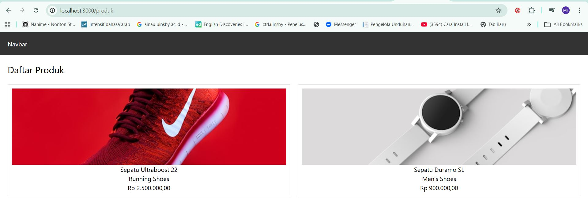
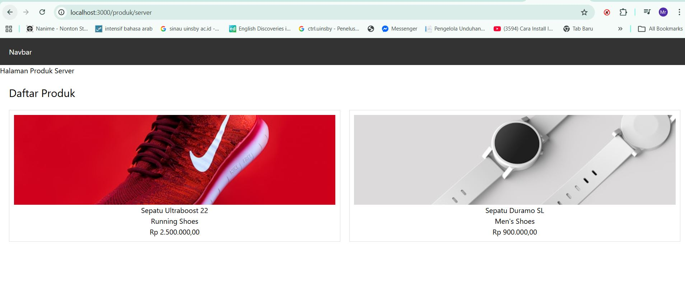
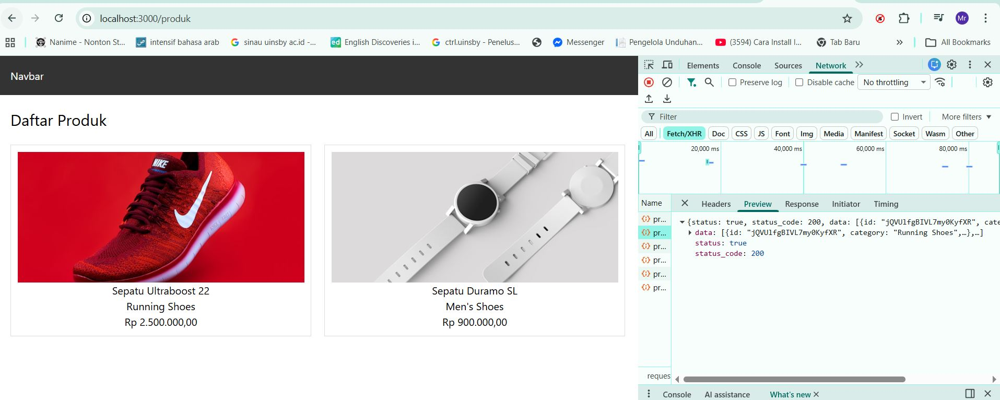
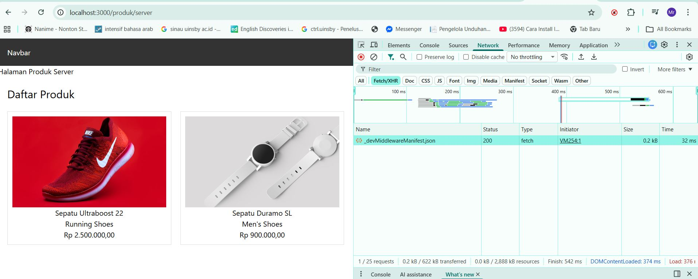

# 📘 Lembar Kerja 9
**Mata Kuliah:** Kerangka Pemrograman Berbasis Framework  
**Nama:** Fajrul Santoso  

---

## 🧪 Hasil Praktikum

### Bagian 1 – Setup Halaman SSR

#### 📸 Hasil Implementasi:

---

---                 

---

## 🧪 Hasil Praktikum

###  Bagian 2 – Implementasi getServerSideProps pada server.tsx

#### 📸 Hasil Implementasi:

---

---                 

---

## 🧪 Hasil Praktikum

###   Bagian 3 – Refactor Type ( produk type )

#### 📸 Hasil Implementasi:

---

---                 

---

## 🧪 Hasil Praktikum

###    Bagian 4 – Uji Perbedaan SSR vs CSR

#### 📸 Hasil Implementasi:

---

---                 

##  D. Tugas Praktikum

## Analisis Perbedaan CSR dan SSR

### 1. Screenshot CSR

Pada halaman **Client Side Rendering (CSR)**, saat halaman direfresh akan muncul **skeleton atau loading terlebih dahulu** sebelum data produk tampil. Hal ini terjadi karena data diambil oleh browser setelah halaman dimuat menggunakan JavaScript.

### 2. Screenshot SSR

Pada halaman **Server Side Rendering (SSR)**, saat halaman direfresh **data produk langsung tampil tanpa skeleton**. Hal ini karena data sudah diambil di server sebelum halaman dikirim ke browser.

### 3. Perbedaan Network Tab

Pada **CSR**, setelah halaman dimuat browser akan melakukan **request tambahan ke API** untuk mengambil data produk.
Sedangkan pada **SSR**, request data dilakukan di server sehingga browser **tidak melakukan request tambahan setelah halaman dimuat**.

### 4. Perbedaan View Source

Pada **CSR**, ketika melihat *View Source* halaman hanya menampilkan struktur HTML tanpa data produk karena data dimuat oleh JavaScript.
Sedangkan pada **SSR**, data produk sudah terlihat langsung di dalam HTML karena halaman sudah dirender di server.

### Kesimpulan

CSR mengambil data di browser setelah halaman dimuat sehingga biasanya menampilkan loading terlebih dahulu.
SSR mengambil data di server sebelum halaman dikirim ke browser sehingga halaman langsung tampil lengkap. 

## Studi Analisis

### 1. Mengapa SSR lebih baik untuk SEO?

SSR lebih baik untuk SEO karena **konten halaman sudah dirender di server** sebelum dikirim ke browser. Hal ini membuat mesin pencari dapat langsung membaca isi halaman tanpa harus menjalankan JavaScript terlebih dahulu.

### 2. Kapan sebaiknya menggunakan SSR?

SSR sebaiknya digunakan ketika aplikasi membutuhkan **data yang selalu terbaru**, memiliki kebutuhan **SEO yang baik**, atau ketika halaman harus **langsung menampilkan konten lengkap saat pertama kali dibuka**.

### 3. Apa kekurangan SSR dibanding CSR?

Kekurangan SSR adalah **beban server lebih besar** karena server harus merender halaman setiap kali ada request dari pengguna. Selain itu, proses rendering di server dapat membuat performa server menurun jika jumlah pengguna sangat banyak.

### 4. Mengapa skeleton tidak muncul pada SSR?

Skeleton tidak muncul pada SSR karena **data sudah diambil di server sebelum halaman dikirim ke browser**, sehingga ketika halaman ditampilkan data sudah lengkap dan tidak memerlukan loading tambahan.

                
