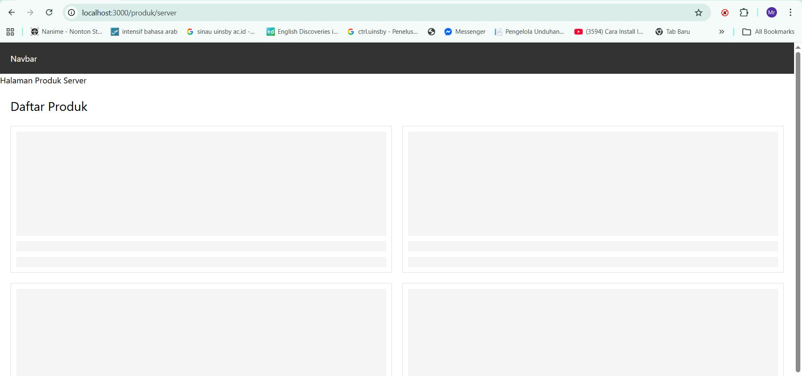

# 📘 Lembar Kerja 9
**Mata Kuliah:** Kerangka Pemrograman Berbasis Framework  
**Nama:** Fajrul Santoso  

---

## 🧪 Hasil Praktikum

###  Bagian 1 – Setup Data Produk

#### 📸 Hasil Implementasi:

---

---                 
