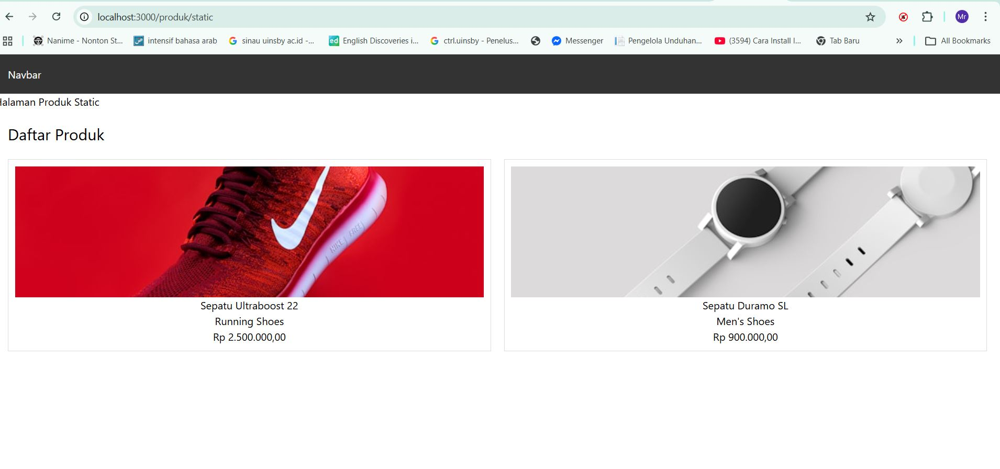
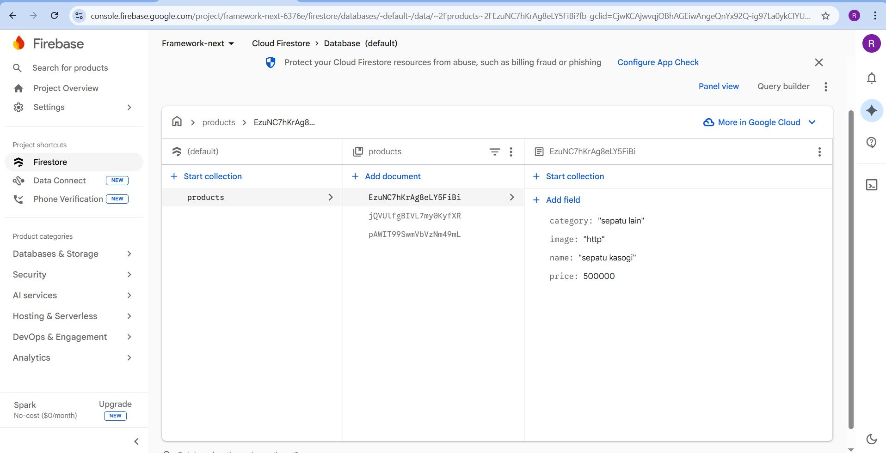
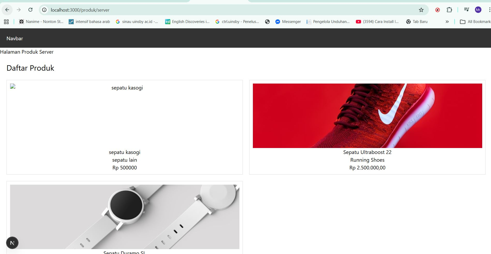

# 📘 Lembar Kerja 10
**Mata Kuliah:** Kerangka Pemrograman Berbasis Framework  
**Nama:** Fajrul Santoso  

---

## 🧪 Hasil Praktikum

### Bagian 1 – Setup Halaman SSR

#### 📸 Hasil Implementasi:

---

---                 

---

---

## 🧪 Hasil Praktikum

### Bagian 1 – Setup Halaman SSR

#### 📸 Hasil Implementasi:

---

---                 

---

---

## 🧪 Hasil Praktikum

### Bagian 1 – Setup Halaman SSR

#### 📸 Hasil Implementasi:

---

---                 

---

