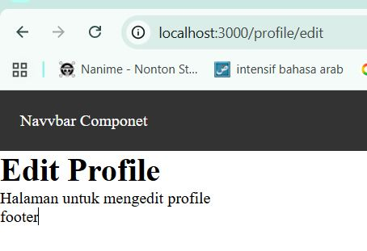
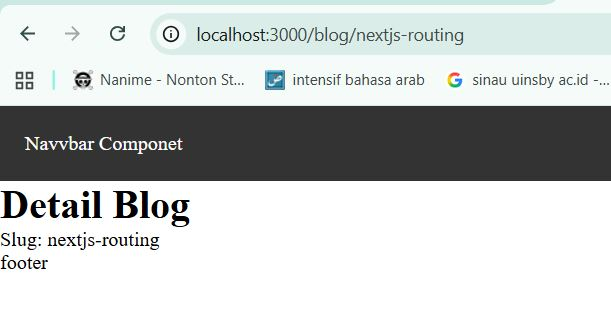
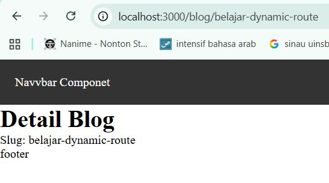
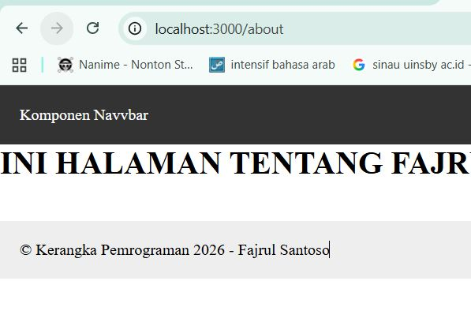

# 📘 Laporan Praktikum – Next.js Routing & Layout

---

## 🚀 Getting Started

Pada praktikum ini, dilakukan implementasi beberapa konsep penting dalam Next.js, yaitu:

1. Routing Dasar (Static Routing)
2. Routing Menggunakan Folder
3. Nested Routing
4. Dynamic Routing
5. Komponen Navbar
6. Layout Global (App Shell)

---

## 1️⃣ Routing Dasar (Static Routing)

Routing dasar pada Next.js dibuat secara otomatis berdasarkan nama file di dalam folder `pages/`.

---

## 2️⃣ Routing Menggunakan Folder

Struktur folder dapat digunakan untuk membuat segment URL yang lebih terorganisir.

---

## 3️⃣ Nested Routing

Nested routing memungkinkan pembuatan halaman bertingkat sesuai dengan struktur folder.

### 📷 Hasil Praktikum

---

## 4️⃣ Dynamic Routing

### a. Membuat Halaman Produk

Dynamic routing memungkinkan halaman dibuat berdasarkan parameter URL seperti ID atau slug.

### 📷 Hasil Praktikum

---

## 5️⃣ Membuat Komponen Navbar

### a. Struktur Komponen

Navbar dibuat sebagai komponen terpisah agar dapat digunakan kembali di berbagai halaman.

### 📷 Hasil Praktikum

---

## 6️⃣ Membuat Layout Global (App Shell)

### a. Membuat AppShell

Layout global memungkinkan komponen seperti Navbar dan Footer muncul di semua halaman.

### 📷 Hasil Praktikum

---

# 📝 E. Tugas Praktikum

---

## ✅ Tugas 1 – Routing

**Instruksi:**
- Membuat halaman:
  - `/profile`
  - `/profile/edit`
- Memastikan routing berjalan tanpa error.

### 📷 Hasil

---

## ✅ Tugas 2 – Dynamic Routing

**Instruksi:**
- Membuat routing `/blog/[slug]`
- Menampilkan nilai slug pada halaman

### 📷 Hasil

---

## ✅ Tugas 3 – Layout

**Instruksi:**
- Menambahkan Footer pada AppShell
- Footer tampil di semua halaman

### 📷 Hasil

---

# 🎯 F. Pertanyaan Refleksi

---

## 1️⃣ Apa perbedaan routing berbasis file dan routing manual?

Routing berbasis file pada Next.js dibuat **otomatis berdasarkan struktur folder di dalam `pages/`**, tanpa perlu konfigurasi tambahan.

Sedangkan routing manual (seperti pada React Router) mengharuskan developer **menuliskan konfigurasi route secara eksplisit di dalam kode**.

---

## 2️⃣ Mengapa dynamic routing penting dalam aplikasi web?

Dynamic routing memungkinkan pembuatan halaman dinamis berdasarkan parameter URL, seperti:

- Detail produk
- Artikel blog
- Profil pengguna

Dengan menggunakan dynamic route seperti `[id].tsx` atau `[slug].tsx`, kita tidak perlu membuat file terpisah untuk setiap data, sehingga aplikasi menjadi lebih efisien dan scalable.

---

## 3️⃣ Apa keuntungan menggunakan layout global dibanding memanggil komponen satu per satu?

Layout global (menggunakan `_app.tsx`) memungkinkan komponen seperti Navbar dan Footer muncul di semua halaman secara otomatis.

Keuntungannya:
- Mengurangi duplikasi kode
- Konsistensi tampilan
- Struktur project lebih rapi
- Mudah melakukan perubahan global

---

# ✅ Kesimpulan

Next.js memberikan kemudahan dalam pengelolaan routing dan layout melalui:

- 📂 File-Based Routing
- 🔄 Dynamic Routing
- 🧱 Layout Global

Konsep ini membuat pengembangan aplikasi menjadi lebih cepat, terstruktur, dan mudah dikembangkan.
