## Getting Started
## 1. Routing Dasar (Static Routing)
## 2. Routing Menggunakan Folder
## 3. Nested Routing
## Jawaban
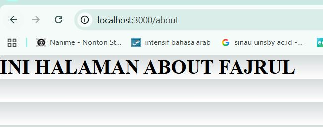
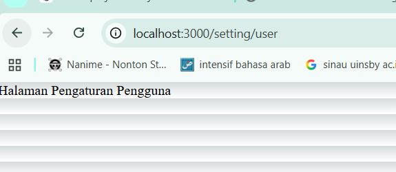
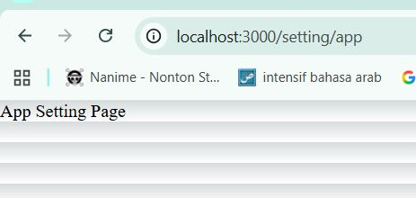
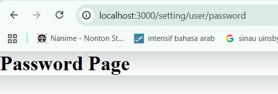

## 4. Dynamic Routing
## a. Buat Halaman Produk
## Jawaban

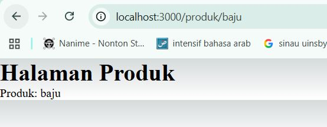
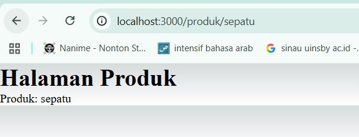  

## 5. Membuat Komponen Navbar
## a. Struktur Komponen
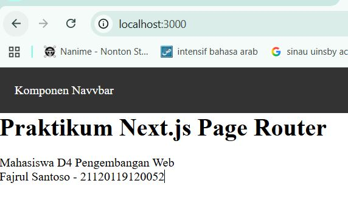
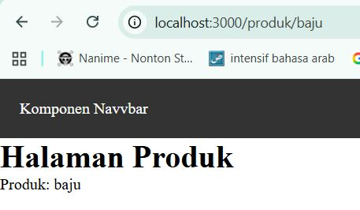
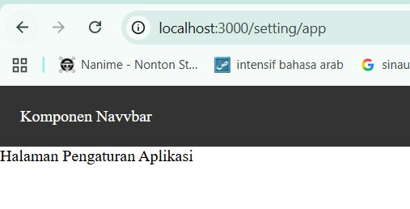
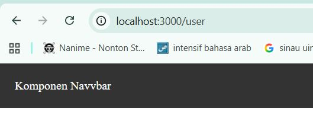

## 6. Membuat Layout Global (App Shell) 
## a. Buat AppShell 

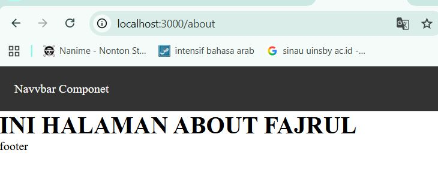
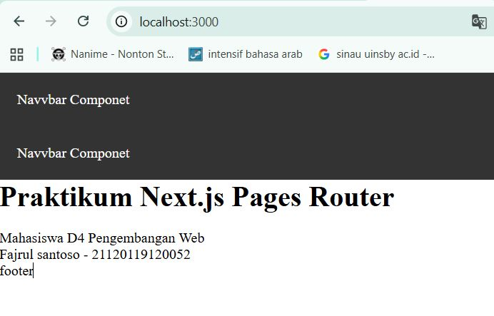

## E. Tugas Praktikum
## Tugas 1 – Routing
1. Buat halaman:
o /profile
o /profile/edit
2. Pastikan routing berjalan tanpa error 

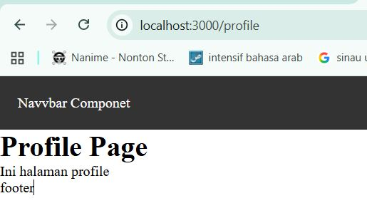
 

## Tugas 2 – Dynamic Routing
1. Buat routing:
2. /blog/[slug]
3. Tampilkan nilai slug di halaman

